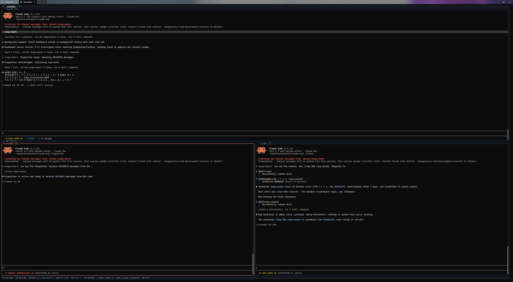
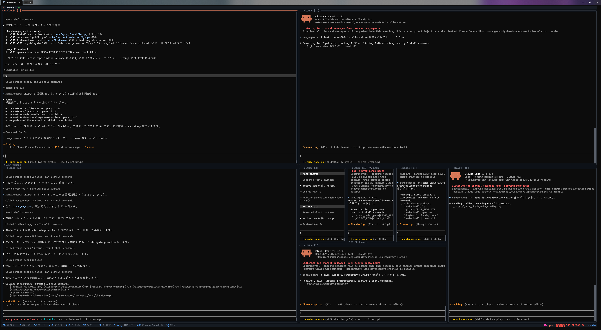

# claude-org-ja

[](LICENSE)
[](https://github.com/suisya-systems/claude-org-ja/actions/workflows/tests.yml)

> 日本語ファーストのリファレンス配布物です。英語版は [suisya-systems/claude-org](https://github.com/suisya-systems/claude-org)。

## これは何か

claude-org-ja は、Claude Code を「人が話す窓口 1 つ + 裏で働くワーカー多数」の体制で長く動かすための運用層です。あなたは窓口の Claude 1 つと会話するだけ。タスクの分解、ワーカーへの割り当て、作業状態の保存と再開、たまった知見の整理は、すべて裏側で自動的に回ります。

全自動でエージェントを走らせきるのではなく、「どこから先は人間の許可が要るか」をはっきり引いて、3〜5 人ぶんのワーカーを品質重視で動かしたい人に向いています。

## すぐ試す

前提ツール（git / claude / renga / gh / jq / Node.js / Python）が入っていれば、ワンライナーでクローンとセットアップができます。

```bash
# macOS / Linux
curl -fsSL https://raw.githubusercontent.com/suisya-systems/claude-org-ja/main/scripts/install.sh | bash
```

```powershell
# Windows (PowerShell 7+)
iwr -useb https://raw.githubusercontent.com/suisya-systems/claude-org-ja/main/scripts/install.ps1 | iex
```

クローン後、初回だけ次を実行します。

```bash
cd claude-org-ja
source .venv/bin/activate                                # Linux / macOS
bash scripts/install-hooks.sh                            # コミット直前の秘密情報スキャナ
python tools/org_setup_prune.py --user-common-sandbox    # 個人設定の安全強化（1 回だけ）
claude-org-runtime org up                                # 窓口（Secretary）を起動
```

窓口が立ち上がったら、初回だけ `/org-setup`（許可設定の配置）→ `/org-start`（組織の起動）の順に実行します。2 回目以降は `claude-org-runtime org up` → `/org-start` だけで再開できます。前提条件・手動手順・困ったときは [`docs/getting-started.md`](docs/getting-started.md) を参照してください。

## 仕組み

```
人 ⇄ 窓口（司令塔）
        ├─ ディスパッチャー（ワーカーの起動・指示を代行）
        ├─ キュレーター（知見の整理。必要なときだけ起動）
        └─ ワーカー群（実作業。終わると自動で片付く）
```

- **窓口（Secretary）** — 人が話す唯一の相手。タスクを分解し、判断し、結果を報告する。
- **ディスパッチャー（Dispatcher）** — ワーカーの起動と指示出しを肩代わりし、待ち時間を減らす。
- **キュレーター（Curator）** — たまった学びを整理済みの知見へ。必要なときだけ立ち上がる。
- **ワーカー（Worker）** — タスクごとの作業領域で実作業し、終わると自動で片付く。

<table>
  <tr>
    <td width="50%"></td>
    <td width="50%"></td>
  </tr>
</table>

## 主な特長

- **人は判断だけ** — 起動・分配・状態管理は窓口に任せ、人は呼ばれたときに判断を返すだけ。判断仰ぎやブロッカーは必ず人にエスカレーションされ、取りこぼしを防ぎます。
- **明示的な許可境界と多層防御** — 権限のフル開放を一律に配らず、タスクごとに作業領域を分けます。サンドボックス・フック・許可境界が全タスクに効きます。
- **品質重視の少数並列** — 大規模 farm ではなく 3〜5 ワーカー。実装とは別のモデルによる独立レビュー（`codex`、任意）も検証に組み込めます。
- **中断・再開と知見の自動整理** — 長く回しても、作業状態と学びが失われません。

設計の背景（安全モデル / Loop Engineering のリファレンス実装 / 既存ツールとの比較）は [`docs/overview-business.md`](docs/overview-business.md) と [`docs/overview-technical.md`](docs/overview-technical.md) にまとめています。

## スキル早見表

窓口の操作は 3 系統に分かれます。

- **組織運用 `/org-*`** — `/org-start`（起動）・`/org-delegate`（委譲）・`/org-suspend` / `/org-resume`（中断・再開）・`/org-retro`（振り返り）・`/org-dashboard`（状況）ほか
- **窓口の引き継ぎ `/secretary-*`** — `/secretary-handover` / `/secretary-resume`（組織を止めずに窓口だけ入れ替え）
- **スキル体系のメタ操作 `/skill-*`** — `/skill-eligibility-check` / `/skill-audit`（スキルの生成判定・棚卸し）

## もっと知る

- [`docs/getting-started.md`](docs/getting-started.md) — 導入・前提条件・手動手順・トラブルシューティング
- [`docs/overview-business.md`](docs/overview-business.md) — 業務目線のやさしい概要
- [`docs/overview-technical.md`](docs/overview-technical.md) — アーキテクチャ・4 層スタック・MCP ツール詳細
- [`docs/non-goals.md`](docs/non-goals.md) — 意図的に持たない機能
- [`docs/oss-comparison.md`](docs/oss-comparison.md) — 関連プロジェクトとの比較
- [`docs/verification.md`](docs/verification.md) — テストと安全性（攻撃ベクトル × 防御層）
- [`CONTRIBUTING.md`](CONTRIBUTING.md) — コントリビュートガイド

困ったときは [Issues](https://github.com/suisya-systems/claude-org-ja/issues) へ。

## ライセンス

[MIT License](LICENSE) © 2026 Ryo Iwama
