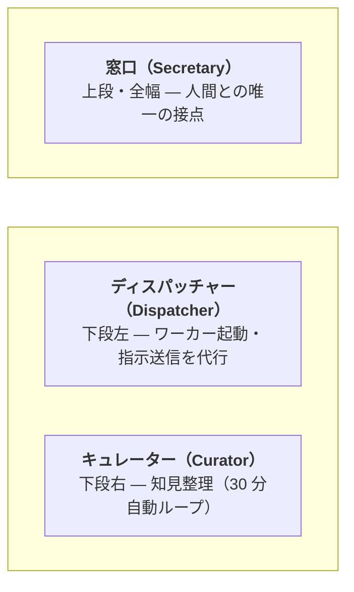

# claude-org-ja

[](LICENSE)
[](https://github.com/suisya-systems/claude-org-ja/actions/workflows/tests.yml)
[](#クイックスタート)

> **claude-org-ja は日本語ファーストのリファレンス配布物です。**
> 英語版: [suisya-systems/claude-org](https://github.com/suisya-systems/claude-org)（日英 2 系統構成。同期ルールは [`docs/sync-policy.md`](docs/sync-policy.md) を参照）。

---

## なぜ claude-org-ja なのか — Agent View との対比

Anthropic 公式の [Claude Code Agent View](https://claude.com/blog/agent-view-in-claude-code) は、複数の Claude Code を 1 画面で見渡すための**可視化機能**です。タブやウィンドウを束ねて表示してくれますが、どのインスタンスを起動するか・どこに何を指示するかを決めるのは、引き続き人間の仕事です。

claude-org-ja が動かそうとしているのは、その「誰がオーケストレーターか」のレイヤーそのものです:

- 人間が会話する相手は **窓口担当の Claude Code 1 つだけ**。
- 新しい Claude Code（ワーカー）を立ち上げるか・どこに何を投げるかは **窓口が判断する**。
- 人間が窓口に話した内容は、窓口の判断で適切なワーカーに自動で分配される。

一言でいえば、**Agent View は「人間がより速く見渡せるようにする」ツール、claude-org-ja は「人間が見渡さなくて済むようにする」運用層** です。**労働集約の先を人間から AI（窓口）に移譲する** — これが差別化の核心です。

さらに、窓口ペインで `/remote-connect` を実行すれば、Web / モバイル / デスクトップの Claude アプリからも本システム全体を操作できます。黒い画面に張り付かなくても、窓口と話すだけで配下のワーカーまで動くので、**他に開いている Claude Code を一切意識しなくてよい**体験が CLI を離れた場所でも成立します。

他に特筆すべき事として、サンドボックスモードやpre-hooksを含めた安全機構を人間が特別な設定を行わなくても全てのタスクに対して自動的に適応することができる点が挙げられます。これは複数のプロジェクトを同時に回す際に特に有効に機能し、auto modeやbypass permissionsを比較的安心して運用可能にすることに繋がります。窓口に事前に指示を行うことで標準的な防御設定から必要な許可を追加で与えることも可能です。

---

## 用語集

このリポジトリで頻出する役割名・周辺ツールの最小定義。各リンク先が一次情報源です。

| 用語 | 意味 | 一次情報源 |
|---|---|---|
| **窓口（Secretary）** | 人間との唯一の接点となる Claude インスタンス。タスク分解・委譲判断・結果伝達のみを担い、実作業は持たない。 | [`CLAUDE.md`](CLAUDE.md) |
| **ディスパッチャー（Dispatcher）** | 窓口の指示を受けてワーカーペインを起動し、作業指示書を渡す代行役。窓口がブロックされる時間を最小化する。 | [`.dispatcher/CLAUDE.md`](.dispatcher/CLAUDE.md) |
| **キュレーター（Curator）** | `knowledge/raw/` に蓄積された生の学びを整理済み知見へ昇華する自動ループ役。30 分間隔で動作する。 | [`.curator/CLAUDE.md`](.curator/CLAUDE.md) |
| **ワーカー（Worker）** | タスク 1 件ごとに起動される実作業担当。専用の作業ディレクトリ境界の中でコード編集・コミットまでを行う（`git push` / プルリクエスト作成は窓口側の責務、ワーカーは PR 作成権限を持たない）。 | [`.claude/skills/org-delegate/SKILL.md`](.claude/skills/org-delegate/SKILL.md) |
| **renga** | Layer 3 の端末多重化器 + `renga-peers` MCP サーバー。ペイン制御とペイン間 P2P メッセージを提供する。 | [suisya-systems/renga](https://github.com/suisya-systems/renga) |

> **See also**: `renga` は旧称 `ccmux` からのリネーム済み（`renga (旧 ccmux)`）。歴史的な名称で検索する読者向けの補足。リネーム経緯は [`docs/operations/m3-migration-runbook.md`](docs/operations/m3-migration-runbook.md) を参照。

---

## 30 秒ピッチ

**問題**: Claude Code を「窓口 1 つ + ワーカー多数」の体制で長時間運用したい。Agent View 等の公式機能は複数インスタンスの**可視化**を解決するが、誰を起動するか・どこに何を指示するか・許可境界の整備・知見蓄積・状態復元といった、**人間が手を動かす範囲**は減らない。tmux 風の素朴な分割や farm 系の全自動並列にも、運用上の規律（許可境界・タスクごとの環境構築・学びの整理）が抜け落ちる。

**解決策**: claude-org-ja は Claude Code 専用の**運用規律フレームワーク**。1 つの窓口 Claude と対話するだけで、ディスパッチャー・キュレーター・ワーカーが裏で自動的に派生し、許可エントリの絞り込み（narrow allowlist）+ タスクごとの作業ディレクトリ境界 + 30 分おきの自動的な知見整理 + 状態の中断・再開を**最初から強制する**。

**対象利用者**: Claude Code を業務で長時間回したい開発者・オペレーターのうち、「全自動より明示的な許可境界が欲しい」「3〜5 ワーカーを品質重視で動かしたい」「知見の自己成長ループを回したい」層。

---

## 4 層アーキテクチャ（要約）

claude-org-ja は 4 層スタックの **Layer 4** に位置するリファレンス配布物です。Layer 3（`renga`）と Layer 2（`claude-org-runtime`）に依存し、Layer 2 はさらに Layer 1（`core-harness`）に依存します。Layer 1〜3 はそれぞれ独立 OSS パッケージとして公開済みで、claude-org-ja (Layer 4) は consumer として取り込む thin shim です。

各層の責務・mermaid 図・パッケージ詳細は [`docs/overview-technical.md`](docs/overview-technical.md) を参照。

---

## クイックスタート

### ワンライナー（推奨）

前提ツール（`git` / `claude` / `renga` / `gh` / `jq` / Node.js / Python — 最小バージョン表は [`docs/getting-started.md`](docs/getting-started.md#前提条件) を参照）が導入済みなら、以下のワンライナーでクローン + `renga mcp install` までを一気に実行できます。

**macOS / Linux（bash）**:

```bash
curl -fsSL https://raw.githubusercontent.com/suisya-systems/claude-org-ja/main/scripts/install.sh | bash
```

**Windows（PowerShell 7+）**:

```powershell
iwr -useb https://raw.githubusercontent.com/suisya-systems/claude-org-ja/main/scripts/install.ps1 | iex
```

スクリプトは前提コマンドの導入有無を確認し、未導入のものがあれば**導入手順を案内して終了**します（自動インストールはしません）。完了後は以下の手順で起動します:

```bash
cd claude-org-ja
source .venv/bin/activate                                # Linux / macOS のみ。Windows native は scripts/install.ps1 が pip install --user 経路のため不要
bash scripts/install-hooks.sh                            # コミット直前の秘密情報スキャナを有効化
python tools/org_setup_prune.py --user-common-sandbox    # main pull 後に 1 回必須 (Issue #429 Task B/C + Issue #433 denyWrite)
renga --layout ops                                       # 窓口（Secretary）ペインを起動
```

> **⏱ 初回起動の所要時間注記**: 初回 clone 直後の `renga --layout ops` + 窓口での `/org-setup` 実行は、通常起動より **数分〜十数分長く**かかります。裏で `pip install -e .`（`core-harness` / `claude-org-runtime` の取得）、`renga mcp install`（MCP サーバー登録）、`/org-setup` による sandbox 補強・PreToolUse フック配備・ロール別 `settings.local.json` 生成が走るためです。2 回目以降も **1〜2 分程度**は見ておいてください（`renga --layout ops` 起動 + 各ペインの Claude / MCP 接続 + `.state/` 復元 + ディスパッチャー・キュレーター自動起動が毎回走るため）。

特定バージョン固定（`CLAUDE_ORG_REF`）・手動手順・`pip install -e .` / `/org-setup` / `/org-start` の詳細は [`docs/getting-started.md`](docs/getting-started.md) を参照。

---

## なぜこれを使うか（既存ツールとの比較）

| 比較対象 | 立ち位置 | claude-org-ja との違い |
|---|---|---|
| **Claude Code Agent View（公式）** | 複数 Claude Code を**1 画面で見渡すための可視化機能**。指示先の選択は引き続き人間が担う | claude-org-ja は**取りまとめ役を窓口 AI が担う**。起動・指示・分配の判断ごと AI 側へ渡す。窓口で `/remote-connect` を実行すれば Web / モバイル / デスクトップの Claude アプリから操作でき、黒い画面に張り付かなくてよい |
| **Claude Code Subagents / Agent Teams（公式）** | Anthropic 公式の「リード / チームメイト」階層 + 自動メモリ + フック | claude-org-ja は公式の上に乗る運用層。**競合せず共存**する。公式が提供しない「タスクごとの作業ディレクトリ境界の強制」「スキーマ駆動の設定 drift 検出」「生の知見 → 整理済み知見への昇華パイプライン」「30 分おきの自動整理ループ」を上乗せする |
| **ccswarm / Ruflo / oh-my-claudecode 等の Claude 系協調基盤** | 固定ロールプール + 大規模並列志向 | claude-org-ja は**タスクごとに作業ディレクトリと `CLAUDE.md` を都度生成**する（事前のロールプールは持たない）。3〜5 ワーカーで品質重視（farm 系とは方向が逆） |
| **tmux / zellij + 手動でのプロンプト分割** | 汎用の端末多重化器 + 人間によるペインの手動運用 | claude-org-ja は専用 MCP サーバー（`renga-peers`）で**ペイン間 P2P メッセージ + 構造化ペイン生成 + 状態の中断・再開**を提供する。手動運用には無い「役割契約」「自動知見整理」「ロール別の許可配布」が中核 |

→ より詳細な 16 軸の比較（CrewAI / LangGraph / AutoGen / Agent Zero / OpenSpace 等を含む）は [`docs/oss-comparison.md`](docs/oss-comparison.md) を参照。

---

## 仕組み

```
人間 <-> 窓口 Claude（司令塔）
              |
              +-> ディスパッチャー（ワーカー起動・指示の代行）
              +-> キュレーター（知見整理、30 分ごとに自動実行）
              +-> ワーカー群（実作業、完了後に自動消滅）
```

**ペインレイアウト（`/org-start` 直後 — 各役割の詳細は[用語集](#用語集)を参照）**:



<table>
  <tr>
    <td width="50%"></td>
    <td width="50%"></td>
  </tr>
  <tr>
    <td><em>直後 (Just started): <code>/org-start</code> 実行直後。窓口・ディスパッチャー・キュレーターの 3 ロールが立ち上がり、ワーカーはまだ存在しない。</em></td>
    <td><em>動作中 (In action with workers): タスク委譲によりディスパッチャーが並列ワーカーを派生させ、4 ロール構成で稼働している状態。</em></td>
  </tr>
</table>

- **窓口（Secretary）**: 人間との唯一の接点。タスク分解・委譲判断・結果報告を担う。運用責務は内部で 3 スキル（[`/org-delegate`](.claude/skills/org-delegate/SKILL.md) / [`/org-escalation`](.claude/skills/org-escalation/SKILL.md) / [`/org-pull-request`](.claude/skills/org-pull-request/SKILL.md)）に分割されている
- **ディスパッチャー（Dispatcher）**: ペイン起動・指示送信を代行し、窓口がブロックされる時間を最小化する
- **キュレーター（Curator）**: 蓄積された生の知見を整理済みの知見に昇華し、スキルやプロセスの改善を提案する
- **ワーカー（Worker）**: 実作業を担当する。タスクごとの作業ディレクトリ境界の中で自律的にコミットまでを行い（プルリクエスト作成は窓口側）、完了後に生の知見を記録する

全ペインは同一タブ内で動作します（別タブを開く `new_tab` は組織運用では使いません）。

---

## 意図的に持たない機能（要約）

claude-org-ja の設計哲学を能動的に明示するため、**意図的に持たない 5 項目**:

1. **ワーカーに `--dangerously-skip-permissions` を既定で撒かない** — 許可エントリの絞り込み + 多層防御を中核価値とする。実作業ロールに許可境界の全面回避を一律で配ることはしない（ディスパッチャーのみ Sonnet 運用上やむなく `bypassPermissions` を採用、詳細は [`docs/non-goals.md`](docs/non-goals.md) §1）
2. **固定ロールプール（フロントエンド / バックエンド / QA エージェント）を持たない** — タスクごとに作業ディレクトリと `CLAUDE.md` を都度生成する。事前のロールプールはタスクごとの規律と矛盾する
3. **大規模並列（20+ エージェント）はしない** — 3〜5 ワーカー想定。品質重視で farm 系とは方向が逆
4. **自然言語からのプロジェクト雛形生成（Auto-create app）はしない** — 運用規律フレームワークであり、雛形生成器ではない
5. **複数プロバイダー切替（Aider / Codex / Gemini 等）はしない** — Claude 専用。`codex` は任意のレビュー用途のみ想定

詳細・残り 7 項目（PTY 層 / `--add-dir` 横断 / MCP の HTTP 公開 等）と「なぜそうしないか」「代替手段は何か」は [`docs/non-goals.md`](docs/non-goals.md) を参照。

---

## スキル一覧

スキルは prefix で 2 系統に分かれます。`/org-*` は組織ランタイム操作（ペイン・ワーカー・状態を直接扱う日々の運用）、`/skill-*` はスキル体系自体のメタ操作（スキルを生み出す / 整理する判断）です。新しくスキルを追加するときはこの prefix 規則に従ってください。

### 組織ランタイム操作（`/org-*`）

起動・派遣・中断・振り返りなど、組織の日々の運用に使う。

| スキル | 用途 |
|---|---|
| `/org-setup` | ロール別の許可設定・環境変数の一括配置（初回および設定変更時） |
| `/org-start` | 組織の起動（起動直後に 1 回実行） |
| `/org-delegate` | 作業の割り当て（自動発動）。窓口 3 スキルの 1 つ（[#320](https://github.com/suisya-systems/claude-org-ja/issues/320) carve-out） |
| `/org-escalation` | ワーカーからの判断仰ぎ・スコープ拡張・ブロッカーを人間にエスカレーション（窓口は一次承認しない）。窓口 3 スキルの 1 つ |
| `/org-pull-request` | ワーカー完了報告 + ユーザー承認後の push / PR 作成 / CI 監視 / レビュー指摘ループ / マージ後クローズ。窓口 3 スキルの 1 つ |
| `/org-suspend` | 作業の中断 |
| `/org-resume` | 作業の再開 |
| `/org-retro` | 委譲プロセスの振り返り |
| `/org-curate` | 知見の整理（自動実行） |
| `/org-dashboard` | ダッシュボード表示 |

### スキル体系メタ操作（`/skill-*`）

スキル自体を生み出す / 整理する判断に使う。生成（eligibility-check）→ 棚卸し（audit）の順で自己成長ループを成す。

| スキル | 用途 |
|---|---|
| `/skill-eligibility-check` | 作業パターンをスキル化すべきか判定（`/org-retro` / `/org-curate` から呼ばれ、推奨 / 候補止まり / curated ノートのまま の 3 値で返す） |
| `/skill-audit` | スキルの棚卸し（廃止候補・重複統合の検出） |

---

## ドキュメント

| ドキュメント | 内容 |
|---|---|
| [`docs/getting-started.md`](docs/getting-started.md) | 使い方ガイド・前提条件の最小バージョン表・手動手順・トラブルシューティング |
| [`docs/overview-business.md`](docs/overview-business.md) | 業務目線の機能概要（技術用語を避けた版） |
| [`docs/overview-technical.md`](docs/overview-technical.md) | アーキテクチャ・4 層スタック詳細・MCP ツール詳細 |
| [`docs/non-goals.md`](docs/non-goals.md) | 意図的に持たない機能の詳細（全 12 項目） |
| [`docs/oss-comparison.md`](docs/oss-comparison.md) | 関連プロジェクトとの比較レポート（16 軸） |
| [`docs/verification.md`](docs/verification.md) | テスト手順・検証結果・攻撃ベクトル × 防御層マトリクス（[§12](docs/verification.md#security-matrix)） |
| [`CONTRIBUTING.md`](CONTRIBUTING.md) | コントリビュートガイド |

---

## セキュリティと許可境界

claude-org-ja は **4 層防御**（`permissions.deny` / PreToolUse フック / サンドボックス（sandbox）/ コミット直前の秘密情報スキャナ）を採用しています。**ロールごとに各層の効き方は異なります**:

- **ワーカー / 窓口 / キュレーター（`auto` モード）**: `permissions.deny` と `permissions.allow` がいずれも有効。PreToolUse フックも有効。4 層防御がフル稼働する
- **ディスパッチャー（`bypassPermissions` モード）**: `permissions.deny` と `permissions.allow` は **bypass される**。実効防御は PreToolUse フック（Edit/Write のスコープ限定 / `git push --force` 系・破壊的 `git`・workers 再帰削除・`--no-verify` の遮断）+ 保護対象ディレクトリの自動確認プロンプト + ロール契約による自主規律で構成される

OS 別の sandbox enforcement 差異（**Windows native は Claude Code 側で sandbox enforcement が未実装**、macOS / Linux / WSL2 のみ有効）、攻撃ベクトル × 防御層の対応表（`--no-verify` / `eval` / 置換変数 / ホーム dotfile 読み取り / Read tool 経由のバイパス等）、残存リスク（シェル関数経由の bypass・Windows native の sandbox 不在）は [`docs/verification.md` §12 攻撃ベクトル × 防御層マトリクス](docs/verification.md#security-matrix) を参照。ディスパッチャー側の bypass モードの詳細挙動は [`docs/non-goals.md` §1](docs/non-goals.md#1-ワーカーに---dangerously-skip-permissions-を既定で撒かない) にあります。

### 新規 clone 後に 1 回必須の補強

```bash
bash scripts/install-hooks.sh                          # core.hooksPath を .githooks/ に設定（pre-commit secret scanner）
python tools/org_setup_prune.py --user-common-sandbox  # 個人 ~/.claude/settings.json の sandbox denyRead / denyWrite を補強
```

`--user-common-sandbox` は idempotent で、`~/.claude/settings.json` の `sandbox.filesystem.denyRead` に機密 credential ディレクトリ群（`~/.ssh` / `~/.aws` / `~/.kube` / `~/.gnupg` / `~/.docker` / `~/.config/aws-vault`）を、`denyWrite` に `~/.claude/settings.json` 自身を idempotent に union-merge します（実在しないもの・symlink-escape は自動 skip。詳細は [`docs/getting-started.md`](docs/getting-started.md) と [`.claude/skills/org-setup/references/permissions.md`](.claude/skills/org-setup/references/permissions.md)）。`~/.config/gh` は gh CLI が窓口の業務動線（push / PR 作成 / CI 監視 / review feedback ループ / merge cleanup）で必須のため候補から意図的に除外しており、過去のリビジョンで個人 settings.json に残っていれば次回実行時に自動的に prune されます。

---

## 困ったとき

- **`/org-start` しても反応しない / `renga-peers` MCP サーバーが見えない / `gh auth status` が Not logged in** などの典型トラブルは [`docs/getting-started.md` トラブルシューティング](docs/getting-started.md#トラブルシューティング) を参照。
- **互換性の事前確認**: `tools/check_renga_compat.py` で `renga` のバージョンと MCP ツール群を一括確認できます。

それでも解決しない場合は [Issues](https://github.com/suisya-systems/claude-org-ja/issues) へ。

---

## ライセンス

[MIT License](LICENSE) © 2026 Ryo Iwama
