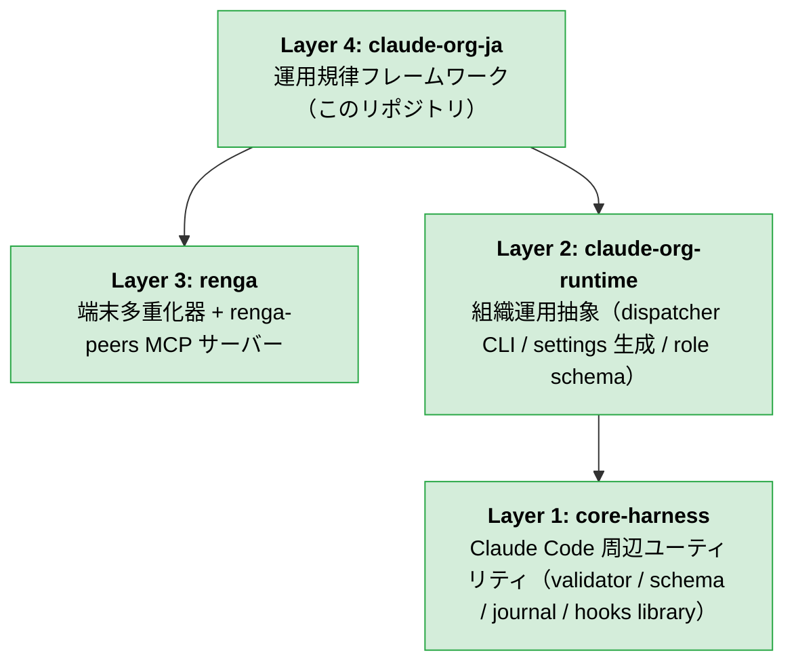
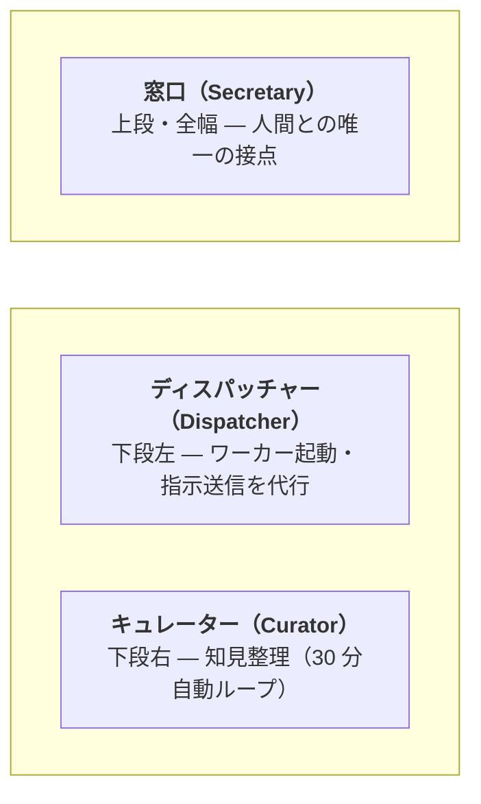

# claude-org-ja

[](LICENSE)
[](https://github.com/suisya-systems/claude-org-ja/actions/workflows/tests.yml)
[](#クイックスタート)

> **claude-org-ja は日本語ファーストのリファレンス配布物です。**
> 英語版: [suisya-systems/claude-org](https://github.com/suisya-systems/claude-org)（日英 2 系統構成。同期ルールは [`docs/sync-policy.md`](docs/sync-policy.md) を参照）。

---

## 用語集

このリポジトリで頻出する役割名・周辺ツールの最小定義。各リンク先が一次情報源です。

| 用語 | 意味 | 一次情報源 |
|---|---|---|
| **窓口（Secretary）** | 人間との唯一の接点となる Claude インスタンス。タスク分解・委譲判断・結果伝達のみを担い、実作業は持たない。 | [`CLAUDE.md`](CLAUDE.md) |
| **ディスパッチャー（Dispatcher）** | 窓口の指示を受けてワーカーペインを起動し、作業指示書を渡す代行役。窓口がブロックされる時間を最小化する。 | [`.dispatcher/CLAUDE.md`](.dispatcher/CLAUDE.md) |
| **キュレーター（Curator）** | `knowledge/raw/` に蓄積された生の学びを整理済み知見へ昇華する自動ループ役。30 分間隔で動作する。 | [`.curator/CLAUDE.md`](.curator/CLAUDE.md) |
| **ワーカー（Worker）** | タスク 1 件ごとに起動される実作業担当。専用の作業ディレクトリ境界の中でコード編集・コミットまでを行う（`git push` / プルリクエスト作成は窓口側の責務、ワーカーは PR 作成権限を持たない）。 | [`.claude/skills/org-delegate/SKILL.md`](.claude/skills/org-delegate/SKILL.md) |
| **renga** | Layer 3 の端末多重化器 + `renga-peers` MCP サーバー。ペイン制御とペイン間 P2P メッセージを提供する。 | [suisya-systems/renga](https://github.com/suisya-systems/renga) |

> **See also**: `renga` は旧称 `ccmux` からのリネーム済み（`renga (旧 ccmux)`）。歴史的な名称で検索する読者向けの補足。リネーム経緯は [`docs/operations/m3-migration-runbook.md`](docs/operations/m3-migration-runbook.md) を参照。

---

## 30 秒ピッチ

**問題**: Claude Code を「窓口 1 つ + ワーカー多数」の体制で長時間運用したい。しかし Claude Code は単独セッション前提で、複数インスタンスを安全に協調させるための運用層は公式には提供されていない。tmux 風の素朴な分割や、いわゆる farm 系の全自動並列では、許可境界・知見の蓄積・状態の復元・タスクごとの環境構築といった**運用上の規律**が抜け落ちる。

**解決策**: claude-org-ja は Claude Code 専用の**運用規律フレームワーク**である。1 つの窓口 Claude と対話するだけで、ディスパッチャー・キュレーター・ワーカーが裏で自動的に派生し、許可エントリの絞り込み（narrow allowlist）+ タスクごとの作業ディレクトリ境界 + 30 分おきの自動的な知見整理 + 状態の中断・再開を**最初から強制する**。

**対象利用者**: Claude Code を業務で長時間回したい開発者・オペレーターのうち、「全自動より明示的な許可境界が欲しい」「3〜5 ワーカーを品質重視で動かしたい」「知見の自己成長ループを回したい」層。

---

## 前提ツール（Prerequisites）

ワンライナー / 手動手順のいずれを使う場合も、以下のツールは事前に導入しておく必要があります。インストーラ（`scripts/install.sh` / `scripts/install.ps1`）は `git` / `claude` / `renga` / `gh` / `jq` の 5 つを fail-close で検証し、Python は警告のみ、Node.js は Linux / macOS のみ検証します（自動インストールはしません）。表中の用途を満たすには 7 つすべての導入が必要です。

| ツール | 最小バージョン | 用途 | 導入リンク |
|---|---|---|---|
| **`git`** | 2.x 系の任意の安定版 | リポジトリ取得（`git clone`）・コミット・ワーカー作業ディレクトリ管理 | [git-scm.com/downloads](https://git-scm.com/downloads) |
| **GitHub CLI (`gh`)** | 2.x 系の任意の安定版 | プルリクエスト作成・Issue 操作・CI 監視（`gh pr checks --watch`） | [cli.github.com](https://cli.github.com/) |
| **Node.js** | v18+ | `renga` を npm 経由で導入するためのランタイム | [nodejs.org](https://nodejs.org/) |
| **Python** | 3.10+ | `core-harness` / `claude-org-runtime` の `pip install -e .` 実行（`pyproject.toml` の `requires-python` に整合） | [python.org/downloads](https://www.python.org/downloads/) |
| **`jq`** | 1.6+ | `.state/` JSON / `gh api` 出力の整形・抽出（フック内・ツール内で使用） | [jqlang.org/download](https://jqlang.org/download/) |
| **Claude Code CLI (`claude`)** | 最新安定版 | 各ロールペイン本体。初回ログインも `claude` 起動時に行う | [claude.ai/code](https://claude.ai/code) |
| **`renga`** | 0.18.0+ | Layer 3 の端末多重化器 + `renga-peers` MCP サーバー（`npm install -g @suisya-systems/renga@0.18.0`） | [github.com/suisya-systems/renga](https://github.com/suisya-systems/renga) |

---

## 4 層アーキテクチャ

claude-org-ja は 4 層スタックの **Layer 4** に位置するリファレンス配布物。Layer 3（端末多重化器 + MCP サーバー = `renga`）と Layer 2（組織運用ランタイム = `claude-org-runtime`）を依存先として持ち、Layer 2 はさらに Layer 1（`core-harness` = Claude Code 周辺の最小ユーティリティ）に依存します。Layer 3 は Layer 1 とは独立で、`renga` 単体でも端末多重化器として利用可能です。



Phase 5 完了時点で **Layer 1 / 2 / 3 はいずれも独立 OSS パッケージとして公開済み**、claude-org-ja (Layer 4) は consumer として Layer 1〜3 を取り込む thin shim です。各層の責務の詳細は [docs/overview-technical.md](docs/overview-technical.md) を参照。

- **Layer 1: `core-harness`** — v0.3.x として独立 OSS リポ ([suisya-systems/core-harness](https://github.com/suisya-systems/core-harness)) で公開。validator / schema / journal / hooks library を提供し、Layer 2 と claude-org-ja の双方が consumer として利用。
- **Layer 2: `claude-org-runtime`** — v0.1.x として PyPI 公開。dispatcher CLI、`settings.local.json` 生成、bundle 済み role schema を提供。claude-org-ja は派遣プラン生成と worker 用設定生成を本パッケージに委譲。
- **Layer 3: `renga`** — Rust 製 TUI + MCP サーバー。Set D backend interface contract に準拠。`renga` 自体は単体配布済みで、AI 開発以外の用途でも汎用端末多重化器として利用可能。
- **Layer 4: `claude-org-ja` (このリポジトリ)** — Layer 1〜3 を consumer として取り込む日本語ファースト配布物。英語版 [`claude-org`](https://github.com/suisya-systems/claude-org) もこの層の peer。

---

## クイックスタート

### ワンライナー（推奨）

依存ツール（`git` / `claude` / `renga` / `gh` / `jq`）が導入済みなら、以下のワンライナーでクローン + `renga mcp install` までを一気に実行できます。

**macOS / Linux（bash）**:

```bash
curl -fsSL https://raw.githubusercontent.com/suisya-systems/claude-org-ja/main/scripts/install.sh | bash
```

**Windows（PowerShell 7+）**:

```powershell
iwr -useb https://raw.githubusercontent.com/suisya-systems/claude-org-ja/main/scripts/install.ps1 | iex
```

スクリプトは前提コマンドの導入有無を確認し、未導入のものがあれば**導入手順を案内して終了**します（自動インストールはしません）。完了後は以下の手順で起動します:

```bash
cd claude-org-ja
bash scripts/install-hooks.sh                            # コミット直前の秘密情報スキャナを有効化
python tools/org_setup_prune.py --user-common-sandbox    # main pull 後に 1 回必須 (Issue #429 Task B/C + Issue #433 denyWrite)
renga --layout ops                                       # 窓口（Secretary）ペインを起動
```

#### 特定バージョンを固定したい場合（`CLAUDE_ORG_REF`）

デフォルトではインストーラは `main` ブランチを clone します（**最新機能**を試したい場合はこれで OK）。

**再現性**を優先したい・チームで同じバージョンを揃えたい場合は、環境変数 `CLAUDE_ORG_REF` で任意の **branch / tag** を指定できます。現在の安定版 tag は [Releases ページ](https://github.com/suisya-systems/claude-org-ja/releases) を参照してください。

完全な再現性のためには、**インストーラ本体も同じ ref から取得**することを推奨します（そうしないと clone 対象は固定されてもインストーラのロジック自体は `main` 追従になります）。

**macOS / Linux（bash）**:

```bash
REF=v0.1.0
curl -fsSL "https://raw.githubusercontent.com/suisya-systems/claude-org-ja/${REF}/scripts/install.sh" | CLAUDE_ORG_REF="${REF}" bash
```

**Windows（PowerShell 7+）**:

```powershell
$Ref = 'v0.1.0'
$env:CLAUDE_ORG_REF = $Ref
iwr -useb "https://raw.githubusercontent.com/suisya-systems/claude-org-ja/$Ref/scripts/install.ps1" | iex
```

未指定時の挙動は従来通り `main` の clone のままです。存在しない ref を指定した場合はインストーラが**明示的にエラーを出して中断**します（`git clone --branch` が解決に失敗した時点で abort）。

### 手動手順（ワンライナーを使わない場合）

```bash
# 1. 依存ツールを導入（一覧と最小バージョンは「前提ツール（Prerequisites）」セクションを参照）
npm install -g @suisya-systems/renga@0.18.0

# 2. 認証
gh auth login
claude                          # Claude Code の初回ログイン

# 3. このリポジトリを取得
git clone https://github.com/suisya-systems/claude-org-ja.git
cd claude-org-ja

# 4. Python 依存（core-harness / claude-org-runtime）を導入
#    pyproject.toml が SoT。requirements.txt は薄い互換ファイルとして残置。
pip install -e .

# 5. renga の MCP サーバーを Claude Code に登録（初回のみ）
renga mcp install

# 6. pre-commit secret scanner と個人 sandbox 補強（main pull 後に 1 回必須、Issue #429 Task B/C + Issue #433 denyWrite）
bash scripts/install-hooks.sh
python tools/org_setup_prune.py --user-common-sandbox

# 7. 窓口（Secretary）ペインを起動
renga --layout ops
```

窓口ペインで Claude Code が立ち上がったら、**初回のみ** `/org-setup` を実行してロール別の許可・フックの設定を配置します:

```
/org-setup
```

続いて組織を起動します:

```
/org-start
```

これでディスパッチャーとキュレーターが派生し、以後は自然言語で依頼を投げるだけ。詳細は [docs/getting-started.md](docs/getting-started.md) を参照。

---

## なぜこれを使うか（既存ツールとの比較）

| 比較対象 | 立ち位置 | claude-org-ja との違い |
|---|---|---|
| **Claude Code Subagents / Agent Teams（公式）** | Anthropic 公式の「リード / チームメイト」階層 + 自動メモリ + フック | claude-org-ja は公式の上に乗る運用層。**競合せず共存**する。公式が提供しない「タスクごとの作業ディレクトリ境界の強制」「スキーマ駆動の設定 drift 検出」「生の知見 → 整理済み知見への昇華パイプライン」「30 分おきの自動整理ループ」を上乗せする |
| **ccswarm（Rust 製、多重化器なしの協調基盤）** | 固定ロールプール（フロントエンド / バックエンド / QA エージェント等）+ 大規模並列志向 | claude-org-ja は**タスクごとに作業ディレクトリと `CLAUDE.md` を都度生成**する（事前のロールプールは持たない）。3〜5 ワーカーで品質重視（farm 系とは方向が逆） |
| **Aider / aider-codex / Cursor のエージェント** | エディタ統合の単独エージェント、または複数モデル切替対応のコーディング支援ツール | claude-org-ja はコーディング支援ツールではなく**組織運用ランタイム**。Claude Code を素で叩き、組織運用規律を強制する |
| **tmux / zellij + 手動でのプロンプト分割** | 汎用の端末多重化器 + 人間によるペインの手動運用 | claude-org-ja は専用 MCP サーバー（`renga-peers`）で**ペイン間 P2P メッセージ + 構造化ペイン生成 + 状態の中断・再開**を提供する。手動運用には無い「役割契約」「自動知見整理」「ロール別の許可配布」が中核 |

→ より詳細な 16 軸の比較は [docs/oss-comparison.md](docs/oss-comparison.md) を参照。

---

## 仕組み

```
人間 <-> 窓口 Claude（司令塔）
              |
              +-> ディスパッチャー（ワーカー起動・指示の代行）
              +-> キュレーター（知見整理、30 分ごとに自動実行）
              +-> ワーカー群（実作業、完了後に自動消滅）
```

**ペインレイアウト（`/org-start` 直後 — 各役割の詳細は[用語集](#用語集)を参照）**:



<table>
  <tr>
    <td width="50%"></td>
    <td width="50%"></td>
  </tr>
  <tr>
    <td><em>直後 (Just started): <code>/org-start</code> 実行直後。窓口・ディスパッチャー・キュレーターの 3 ロールが立ち上がり、ワーカーはまだ存在しない。</em></td>
    <td><em>動作中 (In action with workers): タスク委譲によりディスパッチャーが並列ワーカーを派生させ、4 ロール構成で稼働している状態。</em></td>
  </tr>
</table>

- **窓口（Secretary）**: 人間との唯一の接点。タスク分解・委譲判断・結果報告を担う。運用責務は内部で 3 スキル（[`/org-delegate`](.claude/skills/org-delegate/SKILL.md) / [`/org-escalation`](.claude/skills/org-escalation/SKILL.md) / [`/org-pull-request`](.claude/skills/org-pull-request/SKILL.md)）に分割されている
- **ディスパッチャー（Dispatcher）**: ペイン起動・指示送信を代行し、窓口がブロックされる時間を最小化する
- **キュレーター（Curator）**: 蓄積された生の知見を整理済みの知見に昇華し、スキルやプロセスの改善を提案する
- **ワーカー（Worker）**: 実作業を担当する。タスクごとの作業ディレクトリ境界の中で自律的にコミットまでを行い（プルリクエスト作成は窓口側）、完了後に生の知見を記録する

全ペインは同一タブ内で動作します（別タブを開く `new_tab` は組織運用では使いません）。

---

## 意図的に持たない機能（要約）

claude-org-ja の設計哲学を能動的に明示するため、**意図的に持たない 5 項目**:

1. **ワーカーに `--dangerously-skip-permissions` を既定で撒かない** — 許可エントリの絞り込み + 多層防御を中核価値とする。実作業ロールに許可境界の全面回避を一律で配ることはしない（ディスパッチャーのみ Sonnet 運用上やむなく `bypassPermissions` を採用、詳細は [docs/non-goals.md](docs/non-goals.md) §1）
2. **固定ロールプール（フロントエンド / バックエンド / QA エージェント）を持たない** — タスクごとに作業ディレクトリと `CLAUDE.md` を都度生成する。事前のロールプールはタスクごとの規律と矛盾する
3. **大規模並列（20+ エージェント）はしない** — 3〜5 ワーカー想定。品質重視で farm 系とは方向が逆
4. **自然言語からのプロジェクト雛形生成（Auto-create app）はしない** — 運用規律フレームワークであり、雛形生成器ではない
5. **複数プロバイダー切替（Aider / Codex / Gemini 等）はしない** — Claude 専用。`codex` は任意のレビュー用途のみ想定

詳細・残り 7 項目（PTY 層 / `--add-dir` 横断 / MCP の HTTP 公開 等）と「なぜそうしないか」「代替手段は何か」は [docs/non-goals.md](docs/non-goals.md) を参照。

---

## スキル一覧

スキルは prefix で 2 系統に分かれます。`/org-*` は組織ランタイム操作（ペイン・ワーカー・状態を直接扱う日々の運用）、`/skill-*` はスキル体系自体のメタ操作（スキルを生み出す / 整理する判断）です。新しくスキルを追加するときはこの prefix 規則に従ってください。

### 組織ランタイム操作（`/org-*`）

起動・派遣・中断・振り返りなど、組織の日々の運用に使う。

| スキル | 用途 |
|---|---|
| `/org-setup` | ロール別の許可設定・環境変数の一括配置（初回および設定変更時） |
| `/org-start` | 組織の起動（起動直後に 1 回実行） |
| `/org-delegate` | 作業の割り当て（自動発動）。窓口 3 スキルの 1 つ（[#320](https://github.com/suisya-systems/claude-org-ja/issues/320) carve-out） |
| `/org-escalation` | ワーカーからの判断仰ぎ・スコープ拡張・ブロッカーを人間にエスカレーション（窓口は一次承認しない）。窓口 3 スキルの 1 つ |
| `/org-pull-request` | ワーカー完了報告 + ユーザー承認後の push / PR 作成 / CI 監視 / レビュー指摘ループ / マージ後クローズ。窓口 3 スキルの 1 つ |
| `/org-suspend` | 作業の中断 |
| `/org-resume` | 作業の再開 |
| `/org-retro` | 委譲プロセスの振り返り |
| `/org-curate` | 知見の整理（自動実行） |
| `/org-dashboard` | ダッシュボード表示 |

### スキル体系メタ操作（`/skill-*`）

スキル自体を生み出す / 整理する判断に使う。生成（eligibility-check）→ 棚卸し（audit）の順で自己成長ループを成す。

| スキル | 用途 |
|---|---|
| `/skill-eligibility-check` | 作業パターンをスキル化すべきか判定（`/org-retro` / `/org-curate` から呼ばれ、推奨 / 候補止まり / curated ノートのまま の 3 値で返す） |
| `/skill-audit` | スキルの棚卸し（廃止候補・重複統合の検出） |

---

## ドキュメント

| ドキュメント | 内容 |
|---|---|
| [docs/getting-started.md](docs/getting-started.md) | 使い方ガイド |
| [docs/overview-technical.md](docs/overview-technical.md) | アーキテクチャ・MCP ツール詳細 |
| [docs/non-goals.md](docs/non-goals.md) | 意図的に持たない機能の詳細 |
| [docs/oss-comparison.md](docs/oss-comparison.md) | 関連プロジェクトとの比較レポート（16 軸） |
| [docs/verification.md](docs/verification.md) | テスト手順・検証結果 |
| [CONTRIBUTING.md](CONTRIBUTING.md) | コントリビュートガイド |

---

## セキュリティと許可境界

claude-org-ja は **4 層防御**（`permissions.deny` / PreToolUse フック / サンドボックス（sandbox）/ コミット直前の秘密情報スキャナ）を採用しています。ただし**ロールごとに各層の効き方は異なります**:

- **ワーカー / 窓口 / キュレーター（`auto` モード）**: `permissions.deny` と `permissions.allow` がいずれも有効。PreToolUse フックも有効。4 層防御がフル稼働する
- **ディスパッチャー（`bypassPermissions` モード）**: `permissions.deny` と `permissions.allow` は **bypass される**（保護対象ディレクトリ `.git/`, `.claude/`, `.vscode/`, `.idea/`, `.husky/` への書き込み確認プロンプトのみ残る）。実効防御は **PreToolUse フック配備済み**: Edit/Write のスコープ限定（`.dispatcher/`, `.state/`, `knowledge/raw/YYYY-MM-DD-{topic}.md` のみ。それ以外は exit 2 でブロック）、`git push --force` 系・破壊的 `git`・workers 再帰削除・`--no-verify` の遮断。ロール契約による自主規律と窓口監視で補完する

`git push --no-verify` 等の検証バイパス、`git push --force` 系の履歴上書き、ステージ差分への秘密情報の混入は、`auto` モードのロールについては複数層で止まります。`.env` や認証情報の読み取りについては Claude Code 側の `sandbox.enabled` の OS 依存があり、**Windows native 環境では sandbox enforcement が現時点で未実装** で `cat .env` が素通りする実測があります（[docs/verification.md §sandbox 実測結果](docs/verification.md) 参照）。macOS (Seatbelt) / Linux / WSL2 (`bubblewrap` + `socat` 導入時) のみで sandbox が有効化されます。ディスパッチャー側のロール契約に基づく自主規律と、bypass モードでの挙動の正確な整理は [docs/non-goals.md §1](docs/non-goals.md#1-ワーカーに---dangerously-skip-permissions-を既定で撒かない) を参照。

各層の責任境界・既知の残存リスク（関数定義経由の回避手段など）・PreToolUse フックの検知範囲は [docs/overview-technical.md](docs/overview-technical.md) と `.hooks/` / `.githooks/` 配下を参照。

### 攻撃ベクトル × 防御層マトリクス

本リポジトリ自身の `.claude/settings.json`（窓口・キュレーター用、`auto` モード）と `.githooks/pre-commit` を基準にした、主要な攻撃ベクトルと各層の対応表です（✅ ブロック / ⚠️ 部分・条件付き / — 対象外 / ➖ 未配備）。**ワーカーロール用テンプレート（[`tools/org_extension_schema.json`](tools/org_extension_schema.json) の `worker_roles.{default,claude-org-self-edit}` が SoT。`.claude/skills/org-setup/references/permissions.md` は同 SoT の参照ドキュメント）にも `check-worker-boundary.sh` / `block-org-structure.sh` / `block-git-push.sh` に加えて `block-no-verify.sh` / `block-dangerous-git.sh` が配備済みです**。`permissions.deny` も `git push` 系と `rm -r` / `rm -rf` に加えて `git fetch` / `git pull` / `git remote add|set-url|remove` / `git submodule` / `git lfs` / `git gc` / `git filter-branch` / `git filter-repo` / `git replace` / `git update-ref` / `git config --global|--local|--worktree` / `git reflog expire|delete` / `git worktree*` を `-C` バリアント込みで拒否します。`--no-verify` / `git reset --hard` / `git branch -D` 系の直接遮断は窓口・キュレーターに加えてワーカー側でも有効になりました（ディスパッチャーは `.dispatcher/` 用の独立した hook 群で別途管理）。

| 攻撃ベクトル | `permissions.deny` | PreToolUse フック | sandbox | pre-commit |
|---|---|---|---|---|
| `git commit --no-verify` 直書き（窓口・キュレーター） | ✅ | ✅ (`block-no-verify.sh`) | — | — |
| `eval "git commit --no-verify"` / `bash -c "..."` | — | ✅ Phase 2a [#79](https://github.com/suisya-systems/claude-org-ja/issues/79): `unwrap_eval_and_bashc` で明示パース | — | — |
| `VAR=$(printf -- '--no-verify'); git commit $VAR` | — | ✅ assignment 収集 + `flatten_substitutions` | — | — |
| `git push --force` / `git reset --hard` / `git branch -D`（窓口・キュレーター） | ✅ | ✅ (`block-dangerous-git.sh`) | — | — |
| `cat .env` / 認証情報読み取り（Bash 経由） | — | — | ⚠️ macOS (Seatbelt) / Linux / WSL2 (`bubblewrap`+`socat`) のみ。**Windows native は Claude Code 側未実装で素通り**（[docs/verification.md §10.1](docs/verification.md)） | — |
| `cat ~/.ssh/<key>` / `cat ~/.aws/credentials`（Bash subprocess 経由のホーム dotfile 読み取り） | — (Issue #429 Task C で共有 settings から除去) | — | ⚠️ 個人 `~/.claude/settings.json` で `python tools/org_setup_prune.py --user-common-sandbox` を 1 回実行すると `sandbox.filesystem.denyRead` に directory-level deny がマージされる（symlink-escape は自動 skip。Issue #429 Task B）。**Bash subprocess (sandboxed commands) のみ防御**: `sandbox.filesystem.denyRead` は sandbox 経由 syscall を止めるが Read tool 自体は止めない | — |
| `echo x >> ~/.claude/settings.json`（Bash subprocess 経由の個人 Claude 設定上書き） | — (Issue #433 で共有 settings の `denyWrite` から除去・個人 settings 側へ移管) | — | ⚠️ 個人 `~/.claude/settings.json` で `python tools/org_setup_prune.py --user-common-sandbox` を 1 回実行すると `sandbox.filesystem.denyWrite` に `~/.claude/settings.json` がマージされる（preventive deny、ファイル未作成でも適用。Issue #433）。**Bash subprocess (sandboxed commands) のみ防御**: Read tool 経由の `Edit(...)` は別 layer (`permissions.deny`) で抑止する | — |
| `Read tool` 経由のホーム dotfile 読み取り（`Read(~/.ssh/<key>)` 等） | — (Issue #429 Task C で共有 settings から除去) | — | — (`sandbox.filesystem.denyRead` は Read tool に逆方向 merge されない。Claude Code 公式 docs は `Read(...)` deny → `denyRead` の一方向 merge のみ規定) | — |
| ステージ差分への秘密情報混入 | — | — | — | ✅ ([.githooks/pre-commit](.githooks/pre-commit)) |
| シェル関数経由の bypass（`f(){ git commit --no-verify; }; f`） | — | ➖ 関数定義の静的解析は非対応 | — | — |

**残存リスク (residual risk)**:
- **シェル関数定義経由のルーティング**: 関数本体内に隠された禁止コマンドは PreToolUse フックの静的解析では検出できません（Phase 2c で検討した shell-layer 静的解析は誤検知率と保守コストの観点から廃案）。sandbox の `denyWrite` も `git commit` などのリポジトリ副作用は止めません。ホーム dotfile の defense-in-depth は [Issue #429](https://github.com/suisya-systems/claude-org-ja/issues/429) Task B/C（`denyRead` 系候補）および [Issue #433](https://github.com/suisya-systems/claude-org-ja/issues/433)（`denyWrite` の `~/.claude/settings.json`）で **共有 `.claude/settings.json` から個人 `~/.claude/settings.json` 側へ移管** されています。`python tools/org_setup_prune.py --user-common-sandbox` を 1 回実行することで、個人環境ごとに directory-level の `sandbox.filesystem.denyRead`（symlink-escape は自動 skip）と file-level の `sandbox.filesystem.denyWrite`（preventive、ファイル未作成でも適用）が同時にマージされます。**この補強は sandboxed Bash サブプロセス経由の read / write のみを止め、Read tool 経由の `Read(~/.aws/<file>)` や Edit tool 経由の `Edit(~/.claude/settings.json)` は止めません**（Claude Code 公式 docs の merge は `Read(...)` deny → `denyRead` / `Edit(...)` deny → `denyWrite` の一方向のみ）。Read / Edit tool 経由は Claude Code 組込の credential 保護層と、worker_role schema (`tools/org_extension_schema.json` の `worker_roles.*`) が emit する `permissions.deny` で受ける残存リスクとして整理されています。WSL2 + DriveFS で `~/.aws` が `/mnt/c/...` への symlink になっている環境では denyRead 側が自動 skip され、bwrap bootstrap 失敗を構造的に避けます（denyWrite は単一ファイル literal のため symlink-escape の影響を受けません）。なお WSL 環境では `claude-org-runtime` が、realpath がサンドボックスの可視範囲から外れる Layer 3 `denyRead` / `denyWrite` エントリを出力時に抑止し、抑止対象を `$comment` フィールドに列挙して出力します。本ベクトルは現状ロール契約による自主規律と上記 user-level sandbox deny の併用で担保されます。
- **Windows native の sandbox 不在**: 上記表のとおり `cat .env` 等は Windows native では素通りします。ワーカー実行環境としては macOS / Linux / WSL2 を推奨し、Windows native では別経路（OS 側のファイル権限・GitHub Secret Scanning 等）で補完してください。

詳細と段階導入の意思決定は [Issue #79](https://github.com/suisya-systems/claude-org-ja/issues/79) と [docs/verification.md §10](docs/verification.md) を参照。

新しくクローンしたら、1 度だけ以下を実行してください:

```bash
bash scripts/install-hooks.sh
python tools/org_setup_prune.py --user-common-sandbox  # 後述「個人 sandbox 補強」参照
```

これで `core.hooksPath` が `.githooks/` に設定され、コミット直前の秘密情報スキャナが有効になります。

### 個人 sandbox の補強（main pull 後に 1 回必須、Issue #429 Task B / C + Issue #433）

> **⚠️ 移行 pre-condition**: 共有 `.claude/settings.json` から個人パスエントリを除去しました:
> - `Read(~/.ssh/*)` / `Read(~/.aws/*)` ([Issue #429](https://github.com/suisya-systems/claude-org-ja/issues/429) Task C, denyRead 系。`~/.config/gh/hosts.yml` も同時に除去したが、gh CLI は窓口業務動線で必須のため個人 sandbox 補強の対象からも除外している)
> - `sandbox.filesystem.denyWrite: ["~/.claude/settings.json"]` ([Issue #433](https://github.com/suisya-systems/claude-org-ja/issues/433), denyWrite 系)
>
> **本 PR を pull した後、`python tools/org_setup_prune.py --user-common-sandbox` を 1 回実行しないと、個人環境の sandbox 防御（denyRead / denyWrite 両系統）が一時的に弱くなります**（共有 settings の defense-in-depth 分が個人側で補完されないため）。

```bash
# diff プレビュー（書き込まない）
python tools/org_setup_prune.py --user-common-sandbox --dry-run

# 実行（既存があれば .bak 自動生成、対象候補が無ければ no-op）
python tools/org_setup_prune.py --user-common-sandbox
```

`~/.claude/settings.json` の `sandbox.filesystem.denyRead` に対し、機密 credential ディレクトリ群（`~/.ssh` / `~/.aws` / `~/.kube` / `~/.gnupg` / `~/.docker` / `~/.config/aws-vault`）を idempotent に union-merge します。**実在しないもの・realpath が HOME を escape する symlink（WSL2 + DriveFS で `~/.aws → /mnt/c/...` のケース等）は自動 skip** されます。`~/.config/gh` は **意図的に候補から除外** しています（gh CLI が窓口の業務動線で必須で、deny すると push / PR 作成 / CI 監視等の運用が止まるため、defense-in-depth と運用継続性のトレードオフで後者を優先）。過去のリビジョンで `~/.config/gh` が個人 settings.json に追加されている場合は、次回 `--user-common-sandbox` 実行時に **自動的に除去** されます（自動的な additive + prune セマンティクス）。

同じフラグで `sandbox.filesystem.denyWrite` に `~/.claude/settings.json` も union-merge します（Issue #433）。denyWrite は **preventive deny** で扱い、対象ファイルが未作成でも entry を追加します（書込防御は fresh install で `~/.claude/settings.json` が Claude Code により初回作成される瞬間から有効にする意図）。他のキー (`theme`, `env`, `permissions` 等) は無触。

実装 / 仕様の詳細は [`.claude/skills/org-setup/references/permissions.md`](.claude/skills/org-setup/references/permissions.md) の「ユーザー共通の sandbox denyRead / denyWrite 補強」節と Task A 調査結論 ([docs/verification.md §10.1 Addendum](docs/verification.md)) を参照。

---

## 困ったとき

- **`/org-start` しても反応しない** → 窓口ペインの Claude Code がログイン済みか確認（`claude` を叩いて初回認証）。`claude mcp list` に `renga-peers` が出ているかも確認
- **`renga-peers` MCP サーバーが見えない** → `renga mcp status` で登録状態を確認し、未登録なら `renga mcp install` を再実行（ユーザースコープ登録なので全ペインに即時反映される）
- **`gh auth status` が Not logged in** → `gh auth login` で GitHub 認証を済ませる。未認証だと窓口（Secretary）がプルリクエストを作れません（PR 作成は窓口の責務、ワーカーはコミットまで）
- **互換性の事前確認**: `tools/check_renga_compat.py` で `renga` のバージョンと MCP ツール群を一括確認できます

それでも解決しない場合は [Issues](https://github.com/suisya-systems/claude-org-ja/issues) へ。

---

## ライセンス

[MIT License](LICENSE) © 2026 Ryo Iwama
