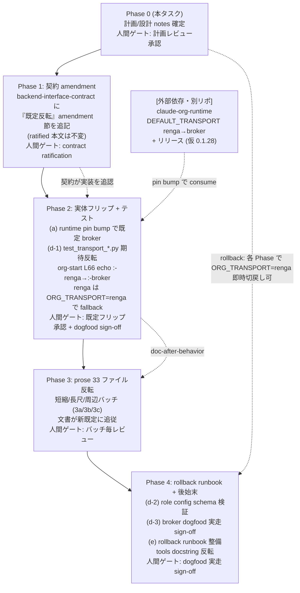

# Epic #586 Phase 0: broker を既定 transport へ昇格する設計/計画

> **目的**: 現行の canonical 文言「既定 `renga` / opt-in `broker`・切戻し可」を「既定 `broker` / opt-in `renga`・切戻し可」へ反転し、broker を既定 transport へ昇格する Epic #586 の全体計画を確定する。本ドキュメントは反転後 canonical 文言テンプレ、dual-system 文言を持つ全ファイルの inventory、既定値フリップの具体 spec、contract 改訂方針（amendment 方式）、フェーズ 1-4 の依存順と PR 粒度を、再現性・監査性を持つ形で示す。

> **スコープ注記（Phase 0 = 計画のみ）**: Phase 0 では prose 33 ファイル・既定値の実体（runtime / ja コード）・contract のいずれも変更しない。**成果物は本ファイル（`notes/broker-promotion-plan-586.md`）の新規作成 1 件のみ**。`.claude/**` には触れない。実体の反転は Phase 1 以降。push / `gh pr create` / merge は全フェーズで窓口の人間承認後に限る（subagent / worker の自動 push 禁止）。

> **時点性注記（Refs #586 #604、2026-06-17 追加 — planning snapshot）**: 本ファイルは 2026-06-15 時点の **Phase 0 計画スナップショット**である。下記 §1 の「反転後 canonical 文言テンプレ」は当初構想した *全面反転後* の目標状態を示すが、Epic #586 の実際の完了は **frame C の二フレームモデル**で行われた — すなわち **コード定数フレーム**（`DEFAULT_TRANSPORT` = 既定 broker、runtime 0.1.28 で flip 済み）と **運用フレーム**（本番 broker 実走 = Epic #6 Issue G **トラック 3** が活性化するまで運用上の既定経路は renga。Issue G の #515 併存 dogfood 自体は批准済みで、未了なのは本番昇格＝トラック 3 のみ）を併記し、手保守 prose は「既定 renga（運用フレーム）」を保ったまま二フレーム注記で整合した（§1 テンプレの全面 prose 置換は適用していない）。本ファイルは当時の計画記録として据え置く。

- **関連 Issue**: Refs #586
- **生成日**: 2026-06-15
- **既定解決 SoT**: `claude_org_runtime.transport`（`DEFAULT_TRANSPORT`、runtime 0.1.27 時点で `"renga"`）。ja は [`tools/transport.py`](../tools/transport.py) の `resolve()` が runtime の `resolve_transport()` へ委譲して consume するのみ（ja はハードコードしない単一 SoT 設計）。
- **contract SoT**: [`docs/contracts/backend-interface-contract.md`](../docs/contracts/backend-interface-contract.md)（全 432 行。ratified 本文不変・amendment 方式）。

---

## 1. 反転後 canonical 文言テンプレ

以下は Phase 0 で確定する「既定 `broker` / opt-in `renga`・切戻し可」反転後のコピペ可能テンプレ。短縮版は CLAUDE.md / 各 skill 冒頭の 1 ヘッダ行ブロック、長尺版は受信モデル / spawn 儀式 / エラー分岐の 3 点ブロックを含む完全版。**リンクの相対パスは差し替え先ファイルの深さに合わせて調整すること**（テンプレ内はリポジトリルート基準で示す）。

### 1.1 短縮版

```markdown
> **輸送層（transport）両系 — 既定 `broker` / opt-in `renga`**: 本ファイル（および各スキル）の `mcp__org-broker__*` 呼び出しは **既定 `broker`**（`ORG_TRANSPORT` 無設定）で書いてあり、そのまま従えばよい（既定挙動）。`ORG_TRANSPORT=renga`（opt-in・切戻し可）では MCP サーバー名が `renga-peers` になり、ツールの **完全修飾名が `mcp__org-broker__*` → `mcp__renga-peers__*`** に機械置換される（引数形・セマンティクスは同一なので手順の論理は変わらない）。輸送依存で手順が変わる点だけ renga 併記する:
>
> - **受信モデル**: 既定 broker は **push 一次**（各ペイン同居の channel sidecar `server:org-broker-channel` が broker キューを ~1 秒間隔で claim→`notifications/claude/channel` で idle セッションへ本文注入。pull = ナッジ + `check_messages` は sidecar 不在 / unhealthy / **channel 非対応ペイン（codex pull-peer）** / claude.ai login 不在時のフォールバック層）。`ORG_TRANSPORT=renga` 時は dispatcher / worker メッセージが `<channel source="renga-peers" …>` として in-band で push される。
> - **spawn 儀式**: 既定 broker は `--mcp-config <broker>` 注入による Claude Code **folder-trust プロンプト**の `send_keys(enter=true)` 機械承認に加え、push 一次のため channel sidecar を `--dangerously-load-development-channels server:org-broker-channel` で load し dev-channel 承認プロンプトを `send_keys(enter=true)` で機械承認する（2 段承認）。`ORG_TRANSPORT=renga` 時は `--dangerously-load-development-channels server:renga-peers` の「Load development channel?」を Enter 承認する 1 段。
> - **エラー分岐**: 既定 broker は shared codes（`pane_not_found` / `last_pane` / `invalid-params`）に加え broker 固有 `[token_invalid]` / `[session_invalid]` / `[tool_not_authorized]` / `[no_backend]`（= adapter_unavailable）/ `[nudge_failed]` / `[peer_not_found]` / `[name_taken]` を返しうる（未知コードは default-branch で escalate）。`ORG_TRANSPORT=renga` 時は broker 固有コードは発生しない。
>
> 契約面の正本は [`docs/contracts/backend-interface-contract.md`](./docs/contracts/backend-interface-contract.md) Surface 8 + push-primary amendment（broker push 一次が **既定の契約**、pull は fallback として retain）。**opt-in `renga` は削除せず常時有効な切戻しの安全装置**として維持する。broker 実走は既定運用経路。
```

### 1.2 長尺版

```markdown
## 輸送層（transport）両系 — 既定 `broker` / opt-in `renga`

本ファイル（および各スキル）の peer message・pane 操作は `mcp__org-broker__*` で書いてあり、**`ORG_TRANSPORT` 無設定＝既定 `broker`** ではそのまま従えばよい。`ORG_TRANSPORT=renga`（opt-in、切戻し可）では MCP サーバー名が `renga-peers` になり、**完全修飾名が `mcp__org-broker__*` → `mcp__renga-peers__*`** に機械置換される（引数形・セマンティクスは同一なので操作の論理は変わらない）。窓口が意識すべき輸送依存の差は次の 3 点:

- **受信モデル（既定 = push 一次 = `claude/channel` / pull フォールバック）**: 既定 broker は **push 一次**に設計されている（runtime push-first 0.1.24+、設計 SoT は transport-lab `docs/design/broker-native-roles.md` §9。**注: push 一次は 0.1.24+ で既出。既定値フリップ（DEFAULT_TRANSPORT renga→broker）は別版・別フェーズ＝Phase 1+ であり、0.1.24 で既に broker 既定になっているわけではない**）: 各ペイン同居の **channel sidecar**（`server:org-broker-channel`）が broker キューを ~1 秒間隔で claim→push し、`notifications/claude/channel` で本文を idle セッションへ注入する（「受けたら即応答」契機が生まれる）。ワーカー ack（`to_id="worker-{task_id}"`）・retro gate ack（`to_id="dispatcher"`）・ディスパッチャー handover 経路の `send_message` / `check_messages` / `send_keys` / `inspect_pane` は同じツール名（`mcp__org-broker__*`）で動く。**pull はフォールバック層**: sidecar 不在 / unhealthy（heartbeat timeout で `delivery_mode=PULL`）/ **channel 非対応ペイン（codex pull-peer）** / claude.ai login 不在時は、各役割が自身の cadence で能動的に `check_messages` する（役割別 cadence: worker=ターン境界 / 完了後 bounded `/loop`・dispatcher=`/loop 3m`・secretary=ターン冒頭。「ナッジを見たら `check_messages`」prose は**撤回せず**この fallback cadence として読む）。`ORG_TRANSPORT=renga`（opt-in）では、ワーカー報告・ディスパッチャー応答が `<channel source="renga-peers" …>` として in-band で push される（renga の in-band push と broker push 一次は同じ即応契機）。契約面は Surface 8 + push-primary amendment で push 一次が **ratified 済み**（2026-06-15、S3。pull は fallback として retain・renga 不変）。
- **spawn 儀式（既定 = folder-trust 承認 + dev-channel sidecar 承認の 2 段）**: 子ペイン起動時、既定 broker は `--mcp-config <broker>` を注入し Claude Code の **folder-trust プロンプト**を `send_keys(enter=true)` で機械承認する**のに加えて**、push 一次のため channel sidecar を `--dangerously-load-development-channels server:org-broker-channel` で load し dev-channel 承認プロンプト（spawn-flow 3-3b）を `send_keys(enter=true)` で機械承認する（folder-trust + dev-channel の 2 段承認。詳細は [`.dispatcher/references/spawn-flow.md`](./.dispatcher/references/spawn-flow.md) 3-2 / 3-3b、設計は broker-native-roles.md §9.5）。`ORG_TRANSPORT=renga`（opt-in）では `--dangerously-load-development-channels server:renga-peers` を注入し「Load development channel?」を Enter 承認する 1 段。**注: attention watcher は transport 非依存の CLI ペインであり、folder-trust / dev-channel いずれの 2 段承認の対象外**（spawn 儀式の反転に巻き込まない）。
- **エラー分岐（既定 = broker 拡張コード込み）**: 既定 broker は shared codes（`pane_not_found` / `last_pane` / `invalid-params`、Surface 6）に加え broker 固有 `[token_invalid]` / `[session_invalid]` / `[tool_not_authorized]` / `[no_backend]`（= adapter_unavailable）/ `[nudge_failed]` / `[peer_not_found]` / `[name_taken]` / `[unknown_tool]` を返しうる（未知コードは default-branch で escalate）。`ORG_TRANSPORT=renga` 時は broker 固有コードは発生せず shared codes + renga 固有コードのみ。

契約面の正本は [`docs/contracts/backend-interface-contract.md`](./docs/contracts/backend-interface-contract.md) Surface 8（broker auth & delivery、ratified 2026-06-14）+ 末尾「Ratified amendment (2026-06-15): push-primary delivery」（S3。**broker push 一次が既定の契約**、pull は structural fallback として retain）、設計 SoT は transport-lab `docs/design/broker-native-roles.md` §9（push 一次）/ `docs/design/ja-migration-plan.md` §5・§8。**opt-in `renga` は削除せず常時有効な fallback として維持する**（切戻しの安全装置）。broker 実走は既定運用経路である。
```

> dispatcher 系（[`.dispatcher/CLAUDE.md`](../.dispatcher/CLAUDE.md)・spawn-flow.md・worker-monitoring.md）への配置では `new_tab` / `focus_pane` が broker surface から意図的に除外されている旨の一文を末尾に保持する。skill 系（org-start 等）は Step 0 の `echo "${ORG_TRANSPORT:-renga}"` を `echo "${ORG_TRANSPORT:-broker}"` に併せて反転する必要がある（これはコード相当＝§3 / PR-2 スコープ。ヘッダの prose 反転と矛盾しないよう同期する）。

### 1.3 現行→反転で何が論理反転するか（対応注記・差し替え時のチェックリスト）

各差し替え時に「文言を機械置換しただけで意味が逆転していない」事故を防ぐためのチェックリスト。左が現行（既定 renga）、右が反転後（既定 broker）の論理。

| 軸 | 現行（既定 renga） | 反転後（既定 broker） | 反転で必須の含意 |
|---|---|---|---|
| ヘッダ既定/opt-in | 既定 `renga` / opt-in `broker` | 既定 `broker` / opt-in `renga` | 「無設定＝renga」→「無設定＝broker」。opt-in 側が renga に入れ替わる |
| 機械置換の向き | `mcp__renga-peers__*` → `mcp__org-broker__*`（broker 時に置換） | `mcp__org-broker__*` → `mcp__renga-peers__*`（renga 時に置換） | 地の文の既定ツール名が `mcp__org-broker__*` になり、置換は opt-in renga 時に発生 |
| 既定の受信モデル | renga in-band push が既定の主経路 | broker push 一次（channel sidecar）が既定の主経路 | push 一次が「broker opt-in 時の挙動」→「既定の主経路」へ昇格。renga in-band push は opt-in 時の挙動に降格 |
| pull の位置づけ | renga 既定では push、broker opt-in 時に pull fallback | 既定 broker でも pull は fallback 層のまま（sidecar 不在/unhealthy/**codex peer**/login 不在時） | pull は両系で常に fallback。**特に codex peer は channel 非対応で反転後も構造的に pull のまま**（push 一次の対象外）。誤って「既定 = pull」とは書かない |
| 既定の spawn 儀式 | renga 1 段（dev-channel `server:renga-peers` を Enter 承認） | broker 2 段（folder-trust + dev-channel `server:org-broker-channel` sidecar 承認） | 既定の儀式が 1 段 Enter → 2 段機械承認へ。renga 1 段は opt-in 時の挙動に |
| 既定のエラーコード集合 | renga（shared + renga 固有）が既定、broker 拡張は opt-in 時 | shared + broker 拡張コード込みが既定、renga 単独は opt-in 時 | `[token_invalid]` 等の broker 拡張が「既定で出る」前提に。shared codes は両系共通として残す |
| contract 参照表記 | 「renga is the default、broker は opt-in」 | 「broker push 一次が既定の契約、renga は opt-in fallback として retain」 | **ratified 本文（§8.10「Renga is the default and is never removed」等）は機械上書き禁止**。反転は amendment 節で記述し、参照表記のみ「既定の契約 = broker push 一次」へ更新 |
| 切戻し（rollback） | broker → renga が切戻し | renga への切替が切戻し（既定 broker からの安全装置） | 切戻し先が renga である点は不変。ただし「既定からの退避先」という役割に変わる |
| broker の運用上の位置 | 「broker 実走（dogfood）は Epic #6 Issue G スコープで既定経路ではない」 | 「broker 実走は既定運用経路である」 | この一文の反転は必須。現行のままだと既定昇格と矛盾する |

**反転で変えてはいけない（不変の論理）**:
- (a) 引数形・セマンティクスが同一で論理が変わらない点。
- (b) pull が fallback 層である点（**特に codex peer は反転後も構造的に pull のまま＝push 一次の対象外。claude.ai login 不在環境も同様に pull 縮退する**）。
- (c) renga が「never removed」で常時有効な切戻し安全装置である点。
- (d) contract の既存 ratified 本文を上書きせず amendment 方式で追記する点。
- (e) `new_tab` / `focus_pane` が broker surface に無い意図的除外（spawn-flow / dispatcher CLAUDE.md 系のみ記載）、および **attention watcher は transport 非依存の CLI ペインで 2 段承認の対象外**である点。

---

## 2. dual-system 文言 inventory（33 ファイル）

**件数**: `grep -rlE '既定.*renga|opt-in.*broker|ORG_TRANSPORT' --include='*.md' .`（`.worktrees` 除く）= **33 件**。下表は 33 行すべてを網羅。

**凡例 — 文言形態**:
- **短縮**: skill / file 冒頭の 1 行ヘッダ「輸送層（transport）両系 — 既定 `renga` / opt-in `broker`」型
- **長尺**: 受信モデル / spawn 儀式 / エラー分岐の 3 点を含む blockquote ブロック
- **個別 surgical**: テンプレに収まらない散在記述（本文・表・コード例・履歴）を箇所ごとに手当て
- **contract**: テンプレ差し替え不可（amendment 方式 = §4 専管）

**凡例 — 反転処理判定**: 短縮差し替え / 長尺差し替え / surgical（個別反転・機械置換不可）/ contract（§4）

| # | パス | 該当箇所（行 / 節） | 文言形態 | 反転処理判定 | 難度メモ |
|---|------|---------------------|----------|--------------|----------|
| 1 | `.claude/skills/dispatcher-handover/SKILL.md` | L31 blockquote | 長尺 | 長尺差し替え | 標準。push 一次記述あり、テンプレ吸収可 |
| 2 | `.claude/skills/dispatcher-resume/SKILL.md` | L46 blockquote（冒頭注記） | 短縮+導入 | 短縮差し替え | 標準 |
| 3 | `.claude/skills/org-attention-start/SKILL.md` | L31 blockquote | 長尺（watcher 特例付） | 長尺差し替え | 中。「attention watcher は CLI ＝ dev-channel/folder-trust 承認不要」固有注記を反転後も保持要 |
| 4 | `.claude/skills/org-attention-stop/SKILL.md` | L23 blockquote | 長尺（簡略） | 長尺差し替え | 標準 |
| 5 | `.claude/skills/org-curate/SKILL.md` | L32 blockquote | 長尺 | 長尺差し替え | 標準 |
| 6 | `.claude/skills/org-delegate/SKILL.md` | L40 blockquote（冒頭注記）+ 本文の broker 併記多数 | 短縮+導入、本文 surgical | 短縮差し替え + surgical | 高。冒頭は短縮、Step 内に broker 併記が散在。レーン選択・brief 生成記述と絡む |
| 7 | `.claude/skills/org-delegate/references/ack-template.md` | L5 blockquote | 長尺 | 長尺差し替え | 標準 |
| 8 | `.claude/skills/org-delegate/references/claude-org-self-edit.md` | L108 blockquote | 長尺（spawn 承認 2 段の固有注記） | 長尺差し替え | 中。「`.claude/` 編集承認」と「spawn 儀式」のレイヤー分離注記を維持 |
| 9 | `.claude/skills/org-delegate/references/instruction-template.md` | L6 blockquote | 長尺（push/pull fallback 詳説） | 長尺差し替え | 標準 |
| 10 | `.claude/skills/org-delegate/references/pane-layout.md` | L6 blockquote（冒頭注記）+ L41 `spawn_claude_pane` 解説 | 短縮+導入、本文 surgical | 短縮差し替え + surgical | 高。**L41 は単純反転不可** — renga 固有の dev-channel 合成 / bare-`claude` auto-upgrade 機構説明。broker を主・renga を fallback とする語順へ surgical 再構成 |
| 11 | `.claude/skills/org-delegate/references/renga-error-codes.md` | L34 見出し / L36「本ファイルは既定 renga を正典として記述」 | 個別 surgical（renga 固有文書） | surgical | 高。**renga 固有性が最強**。「renga = 正典 / broker = 加算」構造の役割反転 + リネーム検討要。テンプレ機械置換厳禁 |
| 12 | `.claude/skills/org-delegate/references/worker-claude-template.md` | L143 + L156 の 2 箇所 blockquote | 長尺 x2 | 長尺差し替え x2 | 中。報告送信時 / 受信待機時の 2 ブロック両方反転 |
| 13 | `.claude/skills/org-escalation/SKILL.md` | L24 blockquote | 長尺 | 長尺差し替え | 標準 |
| 14 | `.claude/skills/org-pull-request/SKILL.md` | L45 blockquote + L60 本文（pr-watch CI_COMPLETED 受信モデル） | 長尺 + 本文 surgical | 長尺差し替え + surgical | 中。L60 は 2b-i 受信モデルの個別記述 |
| 15 | `.claude/skills/org-retro/SKILL.md` | L24 blockquote | 長尺 | 長尺差し替え | 標準 |
| 16 | `.claude/skills/org-setup/SKILL.md` | L24 blockquote | 長尺（生成ツール射影の特殊版） | 個別 surgical | 高。`permissions.md` の byte 等価アンカーが renga 側。反転で恒等射影の向きが変わる。§3 既定値フリップと強連動 |
| 17 | `.claude/skills/org-start/SKILL.md` | L19 allow コメント、L54 blockquote、**L64-68 transport 判定 Step 0**、L92 broker 分岐、L210 spawn 承認 2 段 | 短縮+導入、本文 surgical 多数 | 短縮差し替え + surgical（重） | 最高。**L66 `echo "${ORG_TRANSPORT:-renga}"` の既定値反転（`:-renga`→`:-broker`）はコード相当＝§3 / PR-2 スコープ**。prose 部分のみ PR-3c |
| 18 | `.claude/skills/org-suspend/SKILL.md` | L29 blockquote（冒頭注記） | 短縮+導入 | 短縮差し替え | 標準 |
| 19 | `.claude/skills/secretary-resume/SKILL.md` | L34 blockquote（冒頭注記） | 短縮+導入 | 短縮差し替え | 標準 |
| 20 | `.claude/skills/skill-audit/SKILL.md` | L26 blockquote | 長尺 | 長尺差し替え | 標準 |
| 21 | `.dispatcher/CLAUDE.md` | L19 見出し（短縮型）、L21 本文（3 点長尺） | 短縮見出し + 長尺本文 | 短縮差し替え（見出し）+ 長尺差し替え（本文） | 中。canonical 長尺の正本級。見出し→3a、本文→3b にまたがる |
| 22 | `.dispatcher/references/pane-close.md` | L5 blockquote | 長尺（retro gate 受信特化） | 長尺差し替え | 中。pull 記述が古め。反転と同時に push 一次へ整合させる surgical 検討余地 |
| 23 | `.dispatcher/references/spawn-flow.md` | L5 blockquote、**L125 spawn 承認 2 段**、L133 送信 transport、L139 send_keys 両系、L143 ultracode 武装 | 短縮+導入、本文 surgical 多数 | 短縮差し替え + surgical（重） | 最高。spawn 儀式の SoT。承認フローの正確性が要、機械置換不可 |
| 24 | `.dispatcher/references/worker-monitoring.md` | L5 blockquote（冒頭注記） | 短縮+導入 | 短縮差し替え | 標準 |
| 25 | `CLAUDE.md` | L13 見出し（短縮型）、L15 本文（3 点長尺）、L21 契約/SoT 参照 | 短縮見出し + 長尺本文 | 短縮差し替え（見出し）+ 長尺差し替え（本文） | 最高（正本）。**canonical 文言の一次定義元**。見出し→3a、本文→3b にまたがる |
| 26 | `README.md` | L20、L60（renga 表「既定 transport」）、L78（4 層アーキ）、L80 blockquote、L128（比較表）、L175 | 個別 surgical 多数（公開 README） | surgical（重） | 高。**ユーザー向け公開文書**。テンプレ非適用、慎重な surgical |
| 27 | `docs/contracts/backend-interface-contract.md` | （§4 で詳細）Surface 8 §8.1/§8.10/top header、2026-06-15 amendment 等 | **contract（ratified 本文）** | **amendment 方式（テンプレ差し替え禁止）** | 最高・特殊。§4 専管 |
| 28 | `docs/design/attention-notification.md` | L5 のみ（「`renga` は初回実装では触らない」） | 個別 surgical（言及のみ） | surgical（据え置き判定） | 低。transport 既定の話でなく実装スコープの言及。**据え置き有力** |
| 29 | `docs/design/renga-decoupling.md` | L5/24/25/28/34/36/44/101/121/346/377 ほか多数 | 個別 surgical（将来設計文書） | surgical（原則据え置き） | 最高・特殊。**end-state 反転を既に記述している設計文書**。機械反転すると時系列が壊れる。原則据え置き |
| 30 | `docs/design/transport-switch-ux.md` | L6/10/25/27/29/36/44/46/58…249 多数 | 個別 surgical（既定 renga 不変条件が前提） | surgical（原則据え置き） | 最高・特殊。L97 が反転耐性を既に主張。原則据え置き + 時点注記検討 |
| 31 | `docs/non-goals.md` | L155/L162（host-local broker 例外、批准履歴） | 個別 surgical（言及のみ） | surgical（据え置き） | 低〜中。transport 既定の反転とは別軸。原則据え置き |
| 32 | `docs/operations/attention-watch.md` | L35 のみ（「renga タブを使わず別ターミナルから常駐」） | 個別 surgical（言及のみ） | surgical（据え置き判定） | 低。運用導線の言及。**据え置き有力** |
| 33 | `docs/operations/broker-dogfood-runbook.md` | L3/5/7/16/23/263-356/609 多数（dogfood 手順、切戻し、dry-run 表） | 個別 surgical（broker 固有運用文書） | surgical（要注意） | 高・特殊。解決順・切戻しの「既定 renga」前提を反転。§3 既定値フリップと連動 |

### 2.1 特殊扱いが要るファイル（明示）

- **contract（amendment 方式・テンプレ差し替え禁止）**: #27 — §4 専管。
- **tools/*.py の docstring（md inventory の 33 件には含まれない別 grep 対象）**: [`tools/transport.py`](../tools/transport.py)(docstring 多数)・[`tools/gen_worker_brief.py`](../tools/gen_worker_brief.py):220・[`tools/gen_delegate_payload.py`](../tools/gen_delegate_payload.py):28/1478・[`tools/org_setup_prune.py`](../tools/org_setup_prune.py)・[`tools/check_role_configs.py`](../tools/check_role_configs.py) が「既定 renga」を docstring / コードで前提化。**§3（既定値フリップ spec）で扱う**。
- **renga 固有性が強く「単純反転でない」文書（surgical 必須・機械置換厳禁）**: #11 renga-error-codes（ファイル名自体が renga アンカー、リネーム検討）、#16 org-setup（byte 等価アンカーが renga 側、§3 連動）、#29 renga-decoupling（end-state 反転を既に設計済み、時系列を壊す機械反転厳禁）、#30 transport-switch-ux（不可侵前提、L97 が反転耐性主張）、#31 non-goals（別軸）、#33 broker-dogfood-runbook（解決順・切戻し前提）。
- **据え置き有力（言及のみ）**: #28 attention-notification、#32 attention-watch（Phase 0 で「据え置き判定」明記推奨）。

### 2.2 集計（PR バッチ振り分けと整合、§5.3 と相互参照）

- **短縮差し替えが発生するファイル**: #2, #6, #10, #17, #18, #19, #21（見出し）, #24, #25（見出し）= **9 ファイルに短縮反転作業がある**（うち #6/#10/#17 は短縮 + 本文 surgical の二段作業、#21/#25 は見出しが短縮・本文が長尺で **PR-3a と PR-3b にまたがる**）。
- **長尺差し替えが発生するファイル**: #1, #3, #4, #5, #7, #8, #9, #12, #13, #14, #15, #20, #21（本文）, #22, #25（本文）= **15 ファイルに長尺反転作業がある**（#14 は長尺 + 本文 surgical、#21/#25 は本文のみ）。
- **個別 surgical（テンプレ非適用 = renga 固有 / 公開文書 / 言及のみ / 据え置き判定込み）**: #6/#10/#14/#16/#17/#23 の本文 surgical 成分 + #11, #26, #28, #29, #30, #31, #32, #33。
- **contract（amendment 方式）**: #27（1 件）。

> **二重作業ファイルの取り扱い（PR バッチ境界の合意事項）**: #6/#10/#17（短縮 + 本文 surgical）と #21/#25（見出し短縮 + 本文長尺）は単一バッチに収まらない。PR-3a（短縮ヘッダ）に「見出し / 1 行ヘッダ部分」、PR-3b（長尺コア）に「本文ブロック / surgical 部分」を振り分け、§5.3 の PR-3a / PR-3b ファイルリストと本集計を同一に保つ。特に **#21（.dispatcher/CLAUDE.md）/ #25（CLAUDE.md）は見出し→3a・本文→3b にまたがる**ことを両所で明記する。

**取りこぼし無し（33/33 網羅）**。

---

## 3. 既定値フリップ spec

### 3.0 検証済み構造事実

| 検証項目 | 結果 | 出典（行番号は 0.1.27 時点・参考。一次参照はシンボル名） |
|---|---|---|
| 既定値の所有者 | `claude_org_runtime.transport` の `DEFAULT_TRANSPORT = "renga"`（runtime 0.1.27） | `descriptor.py`（`DEFAULT_TRANSPORT`、≈L57） |
| env key | `ENV_KEY = "ORG_TRANSPORT"`（runtime 所有） | `descriptor.py`（`ENV_KEY`、≈L52） |
| 解決ロジック | runtime `resolve_transport()`: `explicit is not None ? explicit : (env.get("ORG_TRANSPORT") or DEFAULT_TRANSPORT)`。空文字・未知値は `ValueError` | `descriptor.py`（`resolve_transport`、≈L200-221） |
| ja 側の関与 | [`tools/transport.py`](../tools/transport.py) `resolve()` が `resolve_transport()` へ素委譲。ja は `DEFAULT_TRANSPORT` を re-export するだけでハードコードしない | `tools/transport.py` |
| ja に env baseline 注入はあるか | **無い**。`org-start` / `spawn-flow` / `registry/` のどこにも `export ORG_TRANSPORT=...` やロール env baseline の焼き込みは存在しない（grep 0 件）。両ファイルは broker を「opt-in・無設定なら renga」と**文書化するのみ** | org-start/SKILL.md, spawn-flow.md, registry/ grep |

**最重要の含意**: ja 側の「既定では生成物 byte 等価／file no-op」を担保する分岐は、すべて `if flag == DEFAULT_TRANSPORT:`（= 値比較）で書かれており、リテラル `"renga"` ではない。確認した恒等/no-op 分岐:
- `tools/transport.py` `rewrite_allow_entries`: `if resolved == DEFAULT_TRANSPORT: return list(entries)`（恒等核）
- `tools/org_setup_prune.py` user_common allowlist: `if flag == _transport.DEFAULT_TRANSPORT:`（file no-op）
- `tools/check_role_configs.py`: `rewrite_allow_entries(...) == required` 経由（恒等なら schema 無変更）

→ **`DEFAULT_TRANSPORT` の値が `"broker"` に変われば、これらの恒等/no-op 分岐は自動的に「broker のとき恒等」に追従する**。分岐ロジックの書換えは原理的に不要。フリップは「どの値で恒等になるか」が動くだけ。

### 3.1 フリップ方式の比較（3 案）

| 軸 | 案 A: runtime 側 `DEFAULT_TRANSPORT="broker"` + ja pin bump | 案 B: ja `resolve()` に薄い既定 override 層 | 案 C: A+B 併用（過渡的に env baseline も置く） |
|---|---|---|---|
| 変更点 | runtime `descriptor.py` 1 行（別リポ）。ja は pin `>=0.1.27`→`>=0.1.28`（仮）へ bump | ja `tools/transport.py:resolve()` で `env.get(...) or "broker"` 上書き | 上記両方 + org-start/spawn-flow に一時 env baseline |
| SoT 整合 | ◎ 単一 SoT 維持。ja は consume のみ | ✕ SoT 二重化。runtime は依然 `"renga"` を返すのに ja が別解 → drift の温床 | △ 過渡期だけ二重化を許容 |
| 影響範囲 | runtime を使う全 consumer に波及（ja 単独 Epic を越境）。ただし ja は意図的にそれを望むフェーズ | ja 内に閉じる。だが runtime resolve と ja resolve が食い違う | runtime 越境 + ja 内 override 両方 |
| rollback 容易性 | ◎ `ORG_TRANSPORT=renga` で即 fallback。組織全体の戻しは pin を旧版へ | △ override を消す編集が必要 | △ 2 箇所戻し + env 剥がし |
| テスト影響 | 期待値の更新で済む（ロジック変更不要） | runtime 委譲テスト（seam の「ja==runtime」検証）が構造的に破綻 | 両方の更新が必要 |
| 総評 | クリーン・rollback 安全・設計不変条件維持。難点は runtime リポ越境（別 Epic 調整） | ja 完結だが単一 SoT を破る。**非推奨** | 過渡保険にはなるが恒久解にしない |

**推奨: 案 A（runtime `DEFAULT_TRANSPORT="broker"` + ja pin bump）。** ja の transport seam は「runtime を唯一の SoT として consume し ja はハードコードしない」設計で、恒等/no-op 分岐もすべて `DEFAULT_TRANSPORT` 値追従。よって**正しいフリップ点は runtime の 1 行**であり、ja 側はテスト期待値とテキストの追従更新で済む。案 B は単一 SoT を破り drift を恒久化するため不可。renga fallback は解決順（explicit > env > 既定）が不変なので、`DEFAULT_TRANSPORT` が何であれ `ORG_TRANSPORT=renga` で必ず renga に倒せる（**fallback 制約は案 A で無改修のまま満たされる**）。

**過渡保険の統一見解**: runtime 改修が間に合わない場合の暫定は**案 B（ja `resolve()` の薄い override 単独）**に倒す。案 C の env baseline 注入は「無設定 = fallback の中立点」を壊す害が大きい（§3.3 参照）ため過渡保険にも採らない。案 B は SoT を一時二重化するが env baseline より害が小さく、巻き戻しも override 1 箇所削除で済む。いずれにせよ恒久解は必ず案 A に収束させる。

### 3.2 ja 側「既定 renga 前提」の修正点

恒等分岐ロジックは値追従で**無改修**だが、`DEFAULT_TRANSPORT == "renga"` を**文章/出力/テスト期待として固定している箇所**は追従更新が要る。

**コード（docstring / print 文言 — 動作には無影響だが誤情報化する）:**

| ファイル | 現状の文言 | フリップ後の方針 |
|---|---|---|
| `tools/transport.py` | 「既定（無設定）= renga」「既定 renga では恒等」等 | 「既定 = broker」へ追従。**分岐ロジックは無改修**（値追従）、docstring の例示文だけ broker へ |
| `tools/org_setup_prune.py` | 「renga（既定）は完全 no-op」「default renga transport is a strict …」 | print/docstring を「既定 broker は no-op、renga は ORG_TRANSPORT=renga で射影」へ。**分岐ロジックは無改修** |
| `tools/check_role_configs.py` | 「既定 renga では同一オブジェクトを返す」 | docstring を broker 既定へ追従（ロジック無改修） |
| `tools/gen_worker_brief.py:220` | コメント「既定（ORG_TRANSPORT 無設定）= renga」 | broker へ追従 |
| `tools/gen_delegate_payload.py:28, 1478` | 「renga-peers by default, org-broker when ORG_TRANSPORT=broker」 | 「org-broker by default, renga-peers when ORG_TRANSPORT=renga」へ反転 |

**テスト（期待値の更新 — 案 A 採用時に必須）:**

| ファイル | 内容 | 対応 |
|---|---|---|
| `tests/test_transport_seam.py` | `assertEqual(t.resolve(env={}), "renga")` | `"broker"` へ |
| 〃 `test_default_is_renga` | `DEFAULT_TRANSPORT=="renga"` を assert | 名前ごと `test_default_is_broker` 化、期待 broker |
| 〃 `test_hint_default_is_renga_byte_for_byte` | 既定 hint の byte 等価対象が renga | broker hint へ期待付替え |
| 〃 `test_default_unset_is_bit_equivalent` | 無設定=renga と等価 | 無設定=broker と等価へ |
| `tests/test_transport_allowlist_consume.py` `test_default_unset_env_is_renga_identity` | 無設定で renga 恒等 | 無設定で broker 恒等へ |
| 〃 renga==None 等価系 | renga==None 等価 | broker==None 等価へ |
| **維持**: `test_explicit_renga_is_identity` / `test_identity_for_all_org_roles`（`flag="renga"` 明示） | 「明示 renga は恒等」 | **そのまま維持**（fallback 検証）。加えて `test_explicit_broker_is_identity` 相当を新設し両 transport で明示恒等を回帰固定 |

**registry/org-config**: [`registry/projects.md`](../registry/projects.md) は transport 既定の env baseline を持たない（projects 表のみ）。**修正不要**。`org-setup` skill も env に `ORG_TRANSPORT` を焼かない設計（permissions.md は renga アンカーで byte 不変、broker 射影はツール側）なので**コードとしての修正は不要**。冒頭の dual-system 文言は §2 inventory 対象（本 spec のコード範囲外）。

### 3.3 fallback 制約の明記（spec 不変条件）

- フリップ後も `resolve_transport` の解決順は不変: **explicit > `ORG_TRANSPORT` env > 既定**。`ORG_TRANSPORT=renga` を明示すれば必ず renga へ倒れる。
- ja の renga 経路（`mcp__renga-peers__*` allowlist tier、spawn の `--dangerously-load-development-channels server:renga-peers`、`surface("renga")`）は**削除しない**。`rewrite_allow_entries` は「明示 renga なら恒等」を維持。
- 案 C の env baseline 方式を採らないのは、無設定でも broker に固定すると「無設定 = fallback の中立点」が消え、renga 戻しに env 明示を強制する劣化が生じるため。fallback の安全装置性（無設定で安全側に落ちる）は解決順そのものに委ね、既定値だけを runtime で動かす。

### 3.4 最小変更点（段階化）

**必須（フリップ成立に不可欠）:**
1. runtime `claude_org_runtime/transport/descriptor.py` を `DEFAULT_TRANSPORT = "broker"` に（別リポ・別 Epic 起票）。
2. ja: runtime pin 下限を新版へ bump（`>=0.1.28` 仮）。
3. ja: `tests/test_transport_seam.py` と `tests/test_transport_allowlist_consume.py` の**既定期待値を broker へ更新**。これをやらないと CI が即赤になる。
4. **生成物 golden / fixture が renga 既定で byte 固定されていないかを PR-2 必須チェックとして確認**。`gen_delegate_payload.py` / `gen_worker_brief.py` の出力 golden が renga 前提固定だと PR-2 で CI が落ちる（§5 D-3 / PR-2 レビュー観点に格上げ）。

**推奨（誤情報・運用混乱の防止。動作には無影響）:**
5. `tools/transport.py` / `org_setup_prune.py` / `check_role_configs.py` / `gen_worker_brief.py` / `gen_delegate_payload.py` の docstring・コメント・print 文言を「既定 broker」へ追従（**分岐ロジックは触らない**）。
6. 明示 broker 恒等の回帰テストを新設（`test_explicit_broker_is_identity` 相当）。「明示 renga は恒等」は残し、両 transport の対称性を固定。

**変更しないもの（明示）**: 恒等/no-op の分岐ロジック（`tools/transport.py` / `org_setup_prune.py` / `check_role_configs.py` の `== DEFAULT_TRANSPORT` 比較）、renga surface 定義一式、`permissions.md`（renga アンカーで byte 不変）、`registry/`。

---

## 4. contract 改訂方針（amendment 方式）

### 4.1 走査結果 — `docs/contracts/` で transport 既定に言及する箇所

`docs/contracts/` 配下のうち transport 既定（renga=default / broker=opt-in / `ORG_TRANSPORT` unset=renga / renga never removed）を述べるのは **[`docs/contracts/backend-interface-contract.md`](../docs/contracts/backend-interface-contract.md) の 1 ファイルのみ**。他ファイル（delegation-lifecycle / role / knowledge-curation / role-pattern-sandbox / sandbox-launcher / state-schema / state-semantics / worker-git-guardrails / state-fixture-scrub）に transport-default の normative text は無い（role-contract.md は `mcp__renga-peers__*` を参照するが既定値は宣言しない）。Phase 0 の contract 改訂対象は **`backend-interface-contract.md` 単独**。

`backend-interface-contract.md` 内の renga-default 言明（行番号は本ファイル 432 行版で検証済み。すべて ratified 層）:

| # | 行 | 所属節 | ratified 層 | supersede 対象か |
|---|---|---|---|---|
| 1 | **L5** | top amendment header (2026-06-14) | Surface 8 ratified 2026-06-14 | "Renga … remains the **default** … broker is **opt-in** … never removed" → **supersede 対象（中核）** |
| 2 | L253 | Surface 6 broker note | 2026-06-14 | shared codes 列挙（`pane_not_found` / `last_pane` / `invalid-params`）。既定宣言ではない＝**対象外** |
| 3 | **L275** | Surface 8 §8.1 Status | 2026-06-14 | "Renga … stays the **default** … broker is **opt-in** … never removed" → **supersede 対象（中核）** |
| 4 | L281 | Surface 8 §8.1 | 2026-06-14 | "renga remains the **default** and an always-available fallback" → **supersede 対象** |
| 5 | L286 | Surface 8 §8.6/compat note | 2026-06-14 | "Renga remains the default and the byte-stable baseline" → **supersede 対象** |
| 6 | **L345** | **§8.10 Coexistence, default, and rollback** | 2026-06-14 | "Renga is the **default** and is **never removed** — retained as the opt-in fallback / rollback target" → **supersede 対象（中核・正本）** |
| 7 | L357 | 2026-06-15 push-primary amendment status | S3 amendment | "renga … remains the default + always-available fallback (§8.10)" → **supersede 対象（最新 amendment 内の参照）** |
| 補 | L388 | P-§8.4（push-primary fallback トリガ） | S3 amendment | "channel-incapable peers (codex)" を pull fallback トリガとして明示。**反転対象外だが §1 テンプレで保持必須**（codex は反転後も構造的に pull のまま） |
| 補 | L432 | Amendments log | 2026-06-14/06-15 | 過去 amendment の履歴記述 → **不変更**（履歴は当時の事実。新エントリを末尾追記） |

中核の既定宣言は **L5 (top header) / §8.1 (L275, L281, L286) / §8.10 (L345)**。§8.10 が「default + never removed + rollback target」の正本。L357 は S3 amendment が §8.10 を参照して再述する箇所。

### 4.2 絶対制約と改訂方式

上記はすべて ratified 層に属するため、**機械上書き禁止**。改訂は **新しい amendment 節を追記し、既定を反転する supersede 方式**で行う。本文の renga-default テキストは一切削除・改変しない。

**挿入位置（正確）**: contract は 432 行で、S3 push-primary amendment（〜L396）の後に **`## Decision rationale digest`（L399-428）** と **`### Amendments log`（L429-432）** が続く。新 amendment 節本体は **`## Decision rationale digest` セクションの後**（= `### Amendments log` 見出しの前、または log の後）に置く。**「S3 直後＝L396 の後」に挿入すると Decision rationale digest / Amendments log の前に割り込み、append-only 規律を破るため誤り**。Amendments log への新エントリは log 末尾（現 L432 の後）に 1 行追記する。

### 4.3 supersede 手法の先例（2026-06-15 S3 amendment に倣う）

S3 push-primary amendment（L353-357）は「pull-only を消さずに supersede しつつ retain」した実績がある（L355: "deletes no prior ratified normative text above. It supersedes the pull-only broker delivery semantics … the prior pull-only wording … now reads as the fallback path"）。これを transport-default 版に転用: 「§8.10 / top header / §8.1 の renga-default 言明を削除せず supersede。renga-default の旧文言は削除されず、Phase 0 移行前の歴史的既定（opt-in fallback として retain）として読む」。§8.10 は「supersede しても renga 自体は never removed」を保つ正本なので、新 amendment は **「既定値を反転するが renga は依然 never removed / always-available fallback / rollback target」** を明文化し、rollback safety の保持を §8.10 から継承する。

### 4.4 Phase 0 の ratification status

Phase 0 は計画フェーズで human ratification gate 未取得。先行 amendment が "RATIFIED" の status 行を持つのに対し、本 amendment の status 行は **`proposed, pending human ratification`** とする。実際のフリップ（既定値コード変更）は Phase 1 ratify 後・Phase 2 以降。

### 4.5 amendment ドラフト骨子

> **注**: 以下は Phase 0 のドラフト骨子。日英混在の便宜表記（"renga-as-default 言明" 等）は PR-1 で英語に統一する（contract は英語正本。"言明" → "declaration"）。

```markdown
---

## Proposed amendment (Phase 0, #586): default transport flip — broker as default, renga as opt-in fallback

> **Status: PROPOSED — pending human ratification** (Epic #586 Phase 0; Refs #586).
> This section is an **additive amendment** and **deletes no prior ratified normative
> text above**. It **supersedes the renga-as-default declaration** of the top amendment
> header (L5), §8.1 (L275 / L281 / L286), and **§8.10 ("Coexistence, default, and rollback",
> L345)**: the contracted default transport flips to **`org-broker`** — `ORG_TRANSPORT`
> **unset = `broker`**; **renga (`renga-peers`) becomes opt-in** via `ORG_TRANSPORT=renga`.
> The prior renga-default wording is **not removed**; it now reads as the pre-#586 historical
> default and is retained as documentation of the rollback target. This aligns the contract
> with the Epic #586 promotion plan (notes/broker-promotion-plan-586.md) and the
> default-resolution SoT in claude_org_runtime.transport (DEFAULT_TRANSPORT).
>
> **Ratification precondition (NOT yet satisfied at Phase 0)**: <Epic #586 gate — broker
> dogfood の安定運用実績 / Phase 1-N の prose・既定値フリップ完了 等。確定は計画側>.
> Until ratified, this section is informational and the ratified renga-default text above
> remains operative.

### F-§8.1 / top-header (default declaration → broker)

The ratified top-header (L5) and §8.1 (L275) state "Renga … remains the default
(`ORG_TRANSPORT` unset = `renga`); broker is opt-in (`ORG_TRANSPORT=broker`)".
**Proposed (supersede, not delete)**: the contracted default flips — `ORG_TRANSPORT`
**unset = `broker`**; **`ORG_TRANSPORT=renga` selects renga (opt-in)**. The ratified
sentence is retained verbatim as the pre-#586 default of record. The resolution order is
otherwise unchanged (explicit arg > `ORG_TRANSPORT` env > built-in default); the built-in
default value changes renga → broker at the single SoT (claude_org_runtime.transport;
ja consumes via tools/transport.py:resolve(), no hardcode).

### F-§8.10 (Coexistence, default, and rollback → flipped, renga never removed)

§8.10 (L345) states "Renga is the default and is never removed — retained as the opt-in
fallback / rollback target." **Proposed (supersede, not delete)**: **`org-broker` is now
the default**; **renga is never removed** and is **retained as the opt-in fallback /
rollback target** (selected by `ORG_TRANSPORT=renga`). The never-removed / always-available
/ rollback-safety guarantee of §8.10 is **preserved and reaffirmed** — only the unset-default
side flips. A `transport=renga` rollback re-points the next spawned pane at renga exactly as
§8.10 (and the S3 P-§8.10 rollback note) prescribe; the full-rollback teardown sequence is
unchanged.

### F-§rollback-safety (preservation statement)

Both transports continue to use distinct MCP server names and MAY be registered
simultaneously (§8.10 unchanged). Flipping the unset default does **not** remove renga,
weaken the rollback path, or change the per-pane org-wide single-value selection rule.
The push-primary S3 amendment (2026-06-15) and its renga-untouched clause (L357) remain
operative; this amendment only reads "renga remains the default + fallback" (L357) as
"renga remains the opt-in fallback (no longer the unset default)". The pull-fallback
triggers of P-§8.4 (L388) — including **channel-incapable peers (codex)** and
claude.ai-login-absent environments — are **unchanged**: those peers stay on pull regardless
of which transport is the unset default.

### Amendments log (append at log tail — do not edit prior entries)

- **2026-06-15 proposed (Epic #586 Phase 0; Refs #586)**: added this default-transport-flip
  amendment. Supersedes the renga-as-default declaration of the top header / §8.1 / §8.10 to
  **broker default, renga opt-in fallback** (`ORG_TRANSPORT` unset = `broker`;
  `ORG_TRANSPORT=renga` = renga). **Additive — no prior ratified normative text deleted**;
  renga **never removed**, rollback safety preserved (§8.10), P-§8.4 pull-fallback triggers
  (codex / login-absent) unchanged. **Status: proposed, pending human ratification** (gate
  per Epic #586 plan). Design SoT: notes/broker-promotion-plan-586.md.
```

### 4.6 注意点（実装フェーズ向け）

- Amendments log は **過去エントリを改変せず、新エントリを log 末尾（L432 の後）に 1 行追記**（append-only 規律）。
- L253（shared codes）/ L388（pull-fallback トリガ）は既定宣言ではないため supersede 対象外。ただし L388 の "channel-incapable peers (codex)" は反転後も保持され、§1 テンプレに codex pull fallback として反映する（D-1 参照）。
- 既定解決の実体は contract ではなく runtime `DEFAULT_TRANSPORT`（0.1.27='renga'）にあるため、contract amendment は「契約上の既定宣言の反転」であり、**実フリップは runtime 側 `DEFAULT_TRANSPORT` 変更 + ja pin bump とセット**（Phase 2）。contract amendment 単独では挙動は変わらない。

---

## 5. フェーズ依存順と PR 粒度

### 5.1 設計原則（依存順を決める 3 つの不変条件）

1. **契約は実装を先行追認する（contract-before-code）** — §8.10 が ratified で「Renga is the default and is never removed」と明記。実体を先にフリップすると ratified contract と実挙動が乖離する。契約 amendment（既定反転の ratify）を**実体フリップの前**に置き、契約が実装を追認する。
2. **prose は実体フリップの後（doc-after-behavior）** — prose 反転を実体より先にやると、文書は broker 既定と言うのに `resolve(env={})` は renga を返す乖離が生じる。prose 反転は**実体フリップ merge 済みを依存先**に持つ。
3. **テストは実体フリップと不可分（test-with-behavior）** — `test_default_is_renga` 等は「既定=renga」を固定している。実体フリップと同 PR でこの期待値を反転しないとフリップ PR が自テストで赤くなる。**テスト反転は実体フリップと必ず同 PR**。

全 Phase 共通の安全装置: **`ORG_TRANSPORT=renga` による即時切戻しを各 Phase 末で必ず再確認する**（既定が renga→broker に変わっても renga は削除せず opt-in fallback として残す＝§8.10 の rollback target を維持）。

### 5.2 Phase 依存図



依存順の根拠:

| 依存辺 | 向き | 根拠 |
|---|---|---|
| P1 → P2 | 契約 → 実体 | §8.10 ratified の「renga=default」と挙動乖離を作らない（不変条件 1） |
| RT → P2 | 外部 runtime → 実体 | 案 A 採用時、Phase 2 は runtime DEFAULT_TRANSPORT フリップ + リリースにブロックされる。P1 と並行で runtime Issue 起票 |
| P2 内 (a)+(d-1) | 同 PR | フリップが自テストで赤くならないため期待値を同 PR 反転（不変条件 3） |
| P2 → P3 | 実体 → prose | 文書が新既定に追従。逆順は乖離（不変条件 2） |
| P3 → P4 | prose → runbook/dogfood | rollback runbook は「反転後の状態」前提。dogfood 実走は全反転後の最終 sign-off |

### 5.3 PR バッチ分割表

| PR | 含む変更 | 依存先行 | 検証深度 | レビュー観点 | rollback 単位 |
|---|---|---|---|---|---|
| **PR-1**（Phase 1） | `docs/contracts/backend-interface-contract.md` に **新規 amendment 節「default transport flip to broker」** を追記（**挿入位置 = `## Decision rationale digest` の後**、§4.2）。ratified 本文は機械上書きせず amendment 節で宣言。Amendments log 末尾に 1 行追記 | なし | docs full + 人間 ratify | (1) ratified 本文 **L5/L275/L281/L286/L345/L357** が未改変か diff 確認 (2) amendment が additive か (3) 挿入位置が digest の後・log は末尾追記か (4) §8.10 rollback safety / L388 codex fallback と矛盾しないか | revert で契約は renga 既定に戻る |
| **PR-2**（Phase 2、**コア**） | (a) 既定フリップ: **案 A = runtime pin bump（`DEFAULT_TRANSPORT='broker'` 版へ）**。案 B は runtime 間に合わぬ時の暫定。(d-1) `tests/test_transport_seam.py` / `test_transport_allowlist_consume.py` の既定期待を broker へ反転 + 明示 renga / 明示 broker 恒等の回帰テスト。**org-start L66 `echo "${ORG_TRANSPORT:-renga}"`→`:-broker` のコード相当反転を本 PR に含める**（prose ではないので PR-3 ではなくここ） | PR-1, RT | code full + dogfood sign-off | (1) `resolve(env={})`=='broker'、`resolve(env={ORG_TRANSPORT=renga})`=='renga' (2) ja がハードコードせず単一 SoT を保つか (3) 既存 renga golden が明示 renga で不変か (4) **生成物 golden が renga 既定で byte 固定されていないか**（§3.4-4 必須） (5) push 一次が実際に立つ環境で検証したか / pull 縮退（codex / login 不在）でも成立するか | revert で実体が renga 既定へ即時復帰。運用中は `ORG_TRANSPORT=renga` で**コード変更なしの即時切戻し** |
| **PR-3a**（Phase 3、短縮バッチ） | 1 行ヘッダ（短縮版）の反転: `org-attention-start/stop`, `org-curate`, `org-retro`, `org-suspend`, `secretary-resume`, `skill-audit`, `dispatcher-resume`, `worker-monitoring.md`, **`CLAUDE.md` の見出し行**, **`.dispatcher/CLAUDE.md` の見出し行** + #6/#10/#17 の短縮 1 行ヘッダ部分 | PR-2 | docs full | 短縮テンプレ（§1.1）への機械置換が一貫しているか。1 行/ファイルに収まるか | バッチ revert |
| **PR-3b**（Phase 3、長尺コア） | 長尺ブロックの反転: `dispatcher-handover`, `org-attention-start/stop`(本文), `org-curate`, `org-escalation`, `org-retro`, `skill-audit`, `ack-template.md`, `claude-org-self-edit.md`, `instruction-template.md`, `worker-claude-template.md`(L143/L156), `pane-close.md`, `org-pull-request`(L45), **`CLAUDE.md` 本文ブロック**, **`.dispatcher/CLAUDE.md` 本文ブロック** + #6/#10/#14/#17 の本文 surgical 成分 | PR-2 | docs full | 長尺テンプレ（§1.2）差し替えで spawn 儀式 / 受信モデル記述が新既定（broker push 一次）と整合するか。renga fallback / codex pull / watcher 特例の記述が残るか | バッチ revert |
| **PR-3c**（Phase 3、周辺 docs + 特殊 surgical） | `README.md`, `docs/non-goals.md`, `docs/design/{attention-notification,renga-decoupling,transport-switch-ux}.md`, `docs/operations/{attention-watch,broker-dogfood-runbook}.md`, `renga-error-codes.md`, `pane-layout.md`(L41), `org-setup`, `spawn-flow.md`(本文 surgical), `org-start`(prose 部分のみ — L66 echo は PR-2) | PR-2 | docs full | 設計 docs は「現状記述」か「設計意図」かを区別。過去経緯記述は不用意に書き換えない。**#29/#30/#32 等の据え置き判定を最終確定（追記する 1 文 or no-op）** | バッチ revert |
| **PR-4**（Phase 4） | (e) rollback runbook 整備（broker-dogfood-runbook に「既定 broker 下での `ORG_TRANSPORT=renga` 切戻し手順」節）。(d-2) `tests/test_check_role_configs.py` / role config schema の既定期待検証。(d-3) broker dogfood 実走（unattended cycle）の最終 sign-off 記録。tools 群 docstring（`tools/transport.py` / `gen_worker_brief.py` / `gen_delegate_payload.py` / `org_setup_prune.py` / `check_role_configs.py`）の「既定 renga」前提文言の反転 | PR-2, PR-3a/b/c | code+docs full + dogfood 実走 sign-off | (1) rollback 手順が再現可能か（dry-run）(2) docstring が新既定と整合 (3) dogfood 実走ログが green、push 一次が立つ環境 + pull 縮退（codex/login 不在）両方で sign-off | runbook/test の revert |

### 5.4 タスク (a) 実体フリップの方式選択（PR-2 内の設計判断）

§3.1 の比較に従い **案 A（runtime pin bump）を本線、案 B（ja `resolve()` の薄い override 単独）を runtime リリースが間に合わない場合の暫定**とする。理由: 単一 SoT は契約面の不変条件であり、override 層は技術的負債。Phase 1（契約 amendment）と並行で runtime 側 flip Issue を立て（§5.2 の RT ノード）、runtime リリース後に pin bump で consume するのが原則整合。案 B を取る場合は PR-4 で runtime pin bump に巻き戻す follow-up を必須化する。env baseline（案 C）は過渡保険にも採らない（§3.3）。いずれの案でも `ORG_TRANSPORT=renga` 解決路は不変＝**即時切戻しは保証**される。

### 5.5 人間ゲートの配置

| Phase | 人間ゲート | 性質 |
|---|---|---|
| Phase 0 | 計画 notes（本成果物）のレビュー承認 | 計画着手の合意 |
| Phase 1 | **contract ratification**（amendment 節の ratify 承認） | 契約変更は必ず人間 ratify。ratified 本文不変の確認を含む |
| Phase 2 | **既定フリップ承認** + 初回 **dogfood sign-off**（broker 既定での unattended cycle が通る・push 一次が立つ環境 + pull 縮退でも成立） | 挙動が変わる最重要ゲート |
| Phase 3 | バッチ（3a/3b/3c）毎の通常 PR レビュー承認 | prose の正確性 |
| Phase 4 | **dogfood 実走 sign-off**（rollback dry-run 検証を含む最終承認） | 不可逆でないことの最終確認 |

push / `gh pr create` / merge は全 Phase で従来どおり窓口の人間ゲートを維持（subagent/worker 自動 push 禁止）。

### 5.6 rollback 経路（各 Phase で「不可逆でない」担保）

- **Phase 1**: amendment 節は additive。revert で契約は renga 既定 ratified 状態へ無損失復帰。
- **Phase 2（最重要）**: 2 段の切戻し。(i) **運用時の即時切戻し** = `ORG_TRANSPORT=renga` を立てるだけ（コード変更不要、次 spawn ペインが renga を指す。§8.10）。(ii) **コードレベル巻き戻し** = PR-2 revert（案 A なら pin を旧版へ）。active broker deployment 全体の rollback は §8.10 どおり settings 再生成・broker ペイン respawn・broker daemon 順序停止・token/queue store teardown + S3 P-§8.10 の channel sidecar reap を伴う（runbook 化は PR-4）。
- **Phase 3**: prose のみ。バッチ revert で文言が renga 既定表記へ戻る（挙動には影響しない）。
- **Phase 4**: rollback runbook 自体の整備。(i) の `ORG_TRANSPORT=renga` 切戻しを正式手順化し dry-run で検証 sign-off。

**rollback 安全性の核**: renga は全 Phase を通じて削除されず opt-in fallback として常時有効（§8.10 の "never removed" は契約上も維持）。既定が broker に反転しても `ORG_TRANSPORT=renga` 1 環境変数で**コード/契約変更なしの即時切戻し**が常に可能であり、フリップは不可逆ではない。

### 5.7 prose 33 ファイルを 1 PR にまとめるか分割するか（トレードオフ）

- **1 PR 集約案**: アトミック性が最大（全文書が一斉に新既定へ）。欠点はレビュー負荷（33 ファイル横断 diff）と、1 箇所の差し戻しで全体が止まるリスク。
- **機能群バッチ分割案（推奨、3a/3b/3c）**: レビュー観点が PR ごとに均質（3a=短縮機械置換チェック、3b=長尺 spawn 儀式整合、3c=周辺 docs の過去経緯保護・据え置き判定）になりレビュー負荷が分散。中間状態は「一部文書が新既定・一部が旧表記」になるが、**実体は PR-2 で既に broker 既定**なので「旧表記の文書 = まだ未反転」と読めば運用上の害は小さい（挙動はどちらの文書バージョンでも broker、renga fallback 記述は両版に存在）。3 バッチは互いに独立（PR-2 のみに依存）なので並列レビュー可。

**推奨: 機能群 3 バッチ分割**。33 ファイルの短縮/長尺/設計記述は判定基準が異なり、1 PR では「長尺の spawn 儀式整合」の見落としリスクが高い。実体フリップ（PR-2）先行を前提に中間状態の害が小さく、レビュー品質を優先する。

---

## 6. オープン論点 / 人間判断が要る点

Phase 0（計画）では決め切れず、後続フェーズで人間判断が要る論点を列挙する。

| # | 論点 | Phase 0 の推奨 | 人間判断が要る理由 / 決定タイミング |
|---|---|---|---|
| 1 | **既定フリップ実体の方式（案 A / B / C）** | 案 A（runtime pin bump）本線、案 B 暫定、案 C 不採用 | runtime リポ越境（別 Epic）の調整・リリース時期に依存。Phase 1 着手時に runtime Issue 起票可否を判断 |
| 2 | **contract ratification gate の具体条件** | amendment ドラフトの precondition を「broker dogfood 安定 + prose/実体フリップ完了」と仮置き | ratify は人間専権。どの実績をもって既定反転を契約上 ratify するかの基準確定（Phase 1） |
| 3 | **prose バッチ分割の粒度** | 機能群 3 バッチ（3a/3b/3c） | レビュー体制・並列度の判断。1 PR 集約に倒すか否かは人間レビュー負荷の許容次第（Phase 3 着手時） |
| 4 | **dogfood 実走 sign-off の合格基準** | unattended cycle 完走 + push 一次が立つ環境 + pull 縮退（codex / login 不在）でも成立 | 「既定昇格して良い」最終判断は人間。Phase 2 / Phase 4 ゲート |
| 5 | **renga 固有文書の据え置き / 反転判定**（#11 renga-error-codes のリネーム、#16 org-setup の byte アンカー向き、#28/#29/#30/#31/#32） | 原則据え置き + 必要時 1 文追記。renga-error-codes のリネームは Phase 3 で別途判断 | 設計文書の時系列・end-state 記述を壊さない範囲の確定は人間レビューが要る（PR-3b/3c） |
| 6 | **runtime DEFAULT_TRANSPORT フリップの所有者リポ調整** | claude-org-runtime 側に Issue を起票し ja pin bump と依存ペア化 | クロスリポの release 計画・他 consumer への影響評価は人間判断（Phase 1-2） |
| 7 | **amendment ドラフトの英語化と最終文言** | §4.5 骨子を PR-1 で英語統一・"declaration" 化 | contract は英語正本。最終 normative 文言の確定は ratify 者の判断 |

---

参照ファイル（絶対パス）:
- 契約 SoT: `/Users/iwama.ryo/work/org/claude-org-ja/.worktrees/broker-promote-phase0-586/docs/contracts/backend-interface-contract.md`（renga-default = L5/L275/L281/L286/L345/L357、codex pull fallback = L388、digest = L399-428、Amendments log = L429-432）
- 実体 SoT 委譲: `/Users/iwama.ryo/work/org/claude-org-ja/.worktrees/broker-promote-phase0-586/tools/transport.py`
- テスト既定期待: `/Users/iwama.ryo/work/org/claude-org-ja/.worktrees/broker-promote-phase0-586/tests/test_transport_seam.py`, `/Users/iwama.ryo/work/org/claude-org-ja/.worktrees/broker-promote-phase0-586/tests/test_transport_allowlist_consume.py`, `/Users/iwama.ryo/work/org/claude-org-ja/.worktrees/broker-promote-phase0-586/tests/test_check_role_configs.py`
- runtime pin: `/Users/iwama.ryo/work/org/claude-org-ja/.worktrees/broker-promote-phase0-586/pyproject.toml`（`claude-org-runtime>=0.1.27,<0.2`）
- rollback runbook: `/Users/iwama.ryo/work/org/claude-org-ja/.worktrees/broker-promote-phase0-586/docs/operations/broker-dogfood-runbook.md`
- runtime SoT（読み取り専用・別リポ）: `claude_org_runtime.transport.descriptor`（`DEFAULT_TRANSPORT` / `ENV_KEY` / `resolve_transport`。行番号は 0.1.27 時点・参考）
